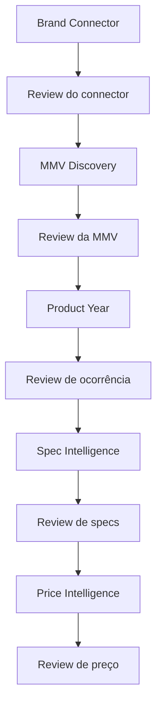

# Agent Platform Architecture — referência canônica

## Sprint 19C — conectores operacionais

O Brand Connector acrescenta targets por marca/mercado e configuração versionada
ACTIVE/SUPERSEDED. Propostas permanecem em findings até review e **ativação explícita**;
Accept continua sem executar proposta. A ativação usa transação com bloqueio por target,
revalidação da última review e índice parcial de ACTIVE único. Um advisory lock por finding,
compartilhado com um trigger INSERT de reviews, evita corrida entre decisão e ativação.
Reviews continuam append-only; o trigger apenas coordena concorrência.

O resolver MMV lê ACTIVE por port, com fallback controlado ao registry 19A. Nenhum
branch de marca é adicionado ao matcher. Registry e sync explícito não escrevem produtos,
specs ou preços. Health check periódico é capability; scheduler apenas na Sprint 23.
UI 19C adiciona Marcas e proposta estruturada, mantendo o redesign geral para Sprint 24.

Especificação, segurança, bootstrap e operação: [Brand Connector 19C](BRAND_CONNECTOR_AGENT_19C.md).

## Estado atual — Sprint 19B

A reconciliação MMV e a plataforma operacional **Runs + Findings + Evidence +
Human Review** estão implementadas no código. O operador confirmou a aplicação
da migration 19B no Staging; a versão local foi alinhada na 19B.1. Os outros
quatro agentes e o scheduler permanecem futuros.
Decisões de review não executam ações canônicas. Detalhes e validação:
[AGENT_PLATFORM_19B.md](AGENT_PLATFORM_19B.md).

`New Product Check Agent` é o nome histórico do código/CLI. Sua responsabilidade
atual corresponde a **MMV Discovery Agent**. Não se renomeiam diretórios nem
comandos nesta Sprint.

### Identidade e ocorrência

```text
MMV = Brand + Model + Version identity
Product occurrence = MMV + Production Year + Model Year
```

No catálogo atual, a separação é virtual:
`CatalogMmvIdentity` agrupa linhas por marca, modelo e versão canônica
normalizados. Cada identidade contém componentes históricos e todas as
`productRows`, com ids, PY/MY, isActive e isPublic. Nem ano nem visibilidade
participam da chave. Rótulos canônicos diferentes não são fundidos por
similaridade.

A tabela física atual continua intacta. Não se criam mmv, vehicle_variants,
canonical_variants ou aliases. Uma entidade física futura dependerá de revisão
própria; não é pré-requisito para a projeção.

Exemplo: Commander Longitude 1.3 TGDI AT nas linhas 960 (2025/2025),
996 (2025/2026), 1064 (2026/2026) e 1128 (2026/2027) é **uma MMV**.
O candidato oficial COMMANDER LONGITUDE T270 7L reconcilia essa MMV e expõe
as quatro ocorrências. Nenhum ano é escolhido como a identidade correta.

## Cinco agentes especializados

| Tipo futuro | Responsabilidade | Saída proposta | Fronteira |
| --- | --- | --- | --- |
| BRAND_CONNECTOR | Propor configuração de fontes oficiais por marca/mercado | NEW_BRAND_CONNECTOR + connector, fixture e benchmark | Não altera catálogo |
| MMV_DISCOVERY | Descobrir modelos/versões oficiais e reconciliar MMVs | NEW_MODEL, NEW_VERSION, AMBIGUOUS_MMV | Não decide necessidade de PY/MY |
| PRODUCT_YEAR | Comparar PY/MY oficiais de uma MMV aprovada com ocorrências existentes | NEW_PRODUCT_YEAR | Não redefine versão/MMV |
| SPEC_INTELLIGENCE | Extrair specs e mapear ao master existente | UNMATCHED_SPEC, SPEC_CHANGE | Não cria spec master arbitrariamente |
| PRICE_INTELLIGENCE | Propor preço público com proveniência e referência temporal | NEW_PRICE, PRICE_CHANGE | Não mistura fontes oficiais/externas nem publica automaticamente |

A plataforma centraliza esses cinco AgentTypes e dez finding types, incluindo
MMV_MATCHED informativo. O MMV atual ainda emite AMBIGUOUS, mapeado para
AMBIGUOUS_MMV na persistência. POSSIBLE_YEAR_CHANGE permanece por compatibilidade
histórica e não é emitido. Nenhum agente futuro foi implementado.

### 1. Brand Connector Agent — futuro

Lê marcas existentes, identifica as que não possuem connector e propõe fontes
oficiais, allowedDomains, source types, search hints e terminology hints.
Gera fixture e executa benchmark antes de propor connector para review.

Estrutura declarativa proposta:

```typescript
interface BrandConnector {
  brand: string;
  market: string;
  allowedDomains: readonly string[];
  sourceTypes: readonly string[];
  searchHints: readonly string[];
  terminologyHints: readonly string[];
}
```

Políticas adicionais, como hosts exatos e subdomínios autorizados, seguem
declarativas. Um domínio externo do mesmo grupo automotivo não se torna oficial
implicitamente. Domínios novos precisam de evidência e review.

Adicionar marca deve exigir connector + fixture + benchmark, sem novo matcher.
Terminology hints ajudam pesquisa/decomposição, não autorizam equivalências
enciclopédicas como T270 = 1.3 ou Hurricane = 2.0. Toyota e Jeep são os únicos
connectors atuais; a terceira marca será um gate futuro.

### 2. MMV Discovery Agent — atual, READ-ONLY

Pergunta: **quais Marca + Modelo + Versão existem oficialmente e já existem na base?**

Executa model discovery, variant resolution, preservação da nomenclatura oficial,
validação de evidências, projeção do catálogo e reconciliação de MMVs. Produz
NEW_MODEL agregado por modelo, NEW_VERSION por variante e ambiguidades reais
de identidade. Não usa número de product rows como número de identidades.

Restrições disponíveis: trim, propulsão, cilindrada na precisão comum,
família de transmissão e tração. Engine labels e nomes comerciais de powertrain
são observações. Fatos explícitos estruturados podem contribuir, sem traduzir
nomes oficiais para nomes históricos.

PY/MY pode aparecer no candidato e no report. Não altera a existência da MMV,
não desempata MMVs e não gera conclusão operacional de ano. Múltiplas observações
de anos são preservadas como pares, sem inventar combinações novas.

### 3. Product Year Agent — futuro

Pergunta: **para esta MMV conhecida e aprovada, quais PY/MY oficiais existem?**

Recebe identidade MMV aprovada, evidências e ocorrências associadas. Compara
pares PY/MY oficiais com product rows existentes e pode propor NEW_PRODUCT_YEAR.
É este agente que poderá indicar a necessidade de uma nova linha física.

Não infere ano de URL, publicação, copyright ou data de execução. Ausência ou
contradição de PY/MY exige revisão. A proposta de criação passa por review e
revalidação; o agente não cadastra uma row por conta própria.

### 4. Spec Intelligence Agent — futuro

Entrada: Product/MMV aprovado, com aplicabilidade de ano quando necessária.
Pesquisa fichas técnicas, configuradores e documentos oficiais.

Extrai e normaliza conforme o master existente: tipos binary, scale e numeric,
spec codes e unidades já definidos. Mantém evidência, unidade de origem e
conversão auditável quando existir regra aprovada. Spec sem correspondência
produz UNMATCHED_SPEC → review. Mudança relevante pode gerar SPEC_CHANGE.

Não cria códigos canônicos arbitrários e não presume que uma ficha se aplica
a todos os anos/versões. Mapeamento de uma spec e aprovação da sua aplicação
são decisões distintas.

### 5. Price Intelligence Agent — futuro

Pesquisa preço público atual com prioridade conceitual:

1. montadora oficial;
2. configurador oficial;
3. lista oficial de preços;
4. fonte automotiva estruturada explicitamente aprovada.

Proposta contém product/MMV, amount, moeda/unidade aplicável, reference date,
source, source type, confidence e capturedAt. Preço observado e data de captura
não substituem a data de referência. Oficial e externo precisam de proveniência
distinta; não há mistura silenciosa.

Produz NEW_PRICE ou PRICE_CHANGE para review. Não sobrescreve histórico nem
altera preço canônico sem workflow aprovado. Regras comerciais e monetárias
serão especificadas na Sprint do agente, não implementadas neste blueprint.

## Orchestrator / Scheduler — infraestrutura futura

Orquestração não é um sexto agente especialista.



Cada etapa pode produzir findings, exigir revisão e interromper a execução
downstream. Rejeição, evidência insuficiente ou identidade ainda ambígua não
liberam a etapa seguinte. Essa sequência descreve dependências conceituais;
agendamento, retries e paralelismo serão especificados depois.

O futuro orchestrator deverá registrar versões de connector/matcher, entradas
aprovadas e idempotência. Mudança do catálogo após um finding exige revalidar a
ação proposta. Nenhuma dessas capacidades de execução foi criada na 19A.4.

## Shared platform — Sprint 19B, implementada localmente

A 19B implementa a base operacional compartilhada:

- `agent_runs`: execução, tipo do agente, escopo, estado, configuração/versionamento
  e métricas;
- `agent_findings`: proposta, identidade alvo, tipo e fingerprint versionado;
- `agent_evidence`: proveniência, referência e associação aos fatos/findings;
- `agent_reviews`: decisão humana, responsável, justificativa e auditoria.

Migration local versionada, contratos/core, adapter dedicado e Admin Review
estão implementados. RLS não concede acesso ao browser; o guard administrativo
protege o repository privilegiado no servidor. O operador confirmou a aplicação
no Staging; versão local 20260913224216.
O MMV permanece JSON/Markdown local por default; --persist-findings habilita
somente persistência operacional. COMPLETED congela observações; reviews são
append-only e Accept não executa proposal.

Tipos centrais: BRAND_CONNECTOR, MMV_DISCOVERY, PRODUCT_YEAR,
SPEC_INTELLIGENCE, PRICE_INTELLIGENCE. Finding types centrais:
MMV_MATCHED, NEW_BRAND_CONNECTOR, NEW_MODEL, NEW_VERSION, AMBIGUOUS_MMV, NEW_PRODUCT_YEAR,
UNMATCHED_SPEC, SPEC_CHANGE, NEW_PRICE, PRICE_CHANGE.

MMV virtual e fingerprint dependem de normalização versionada. A persistência
guarda subject, candidate, warnings, product rows e proveniência para review,
sem assumir que uma mudança do matcher preservará automaticamente as chaves.

## Review humano e fronteira de autonomia

```text
Agent → Finding → Evidence → Review → Canonical Action
```

**Nenhum agente aprova a própria alteração canônica.** Nas primeiras fases,
review humano é obrigatório. Aprovar evidência/identidade não equivale a
autorizar qualquer alteração posterior: a ação deve ser concreta, rastreável e
revalidada contra o estado atual.

Até a Sprint 23, agentes podem pesquisar, extrair, comparar, propor e gerar
evidence e persistir findings operacionais mediante opt-in explícito.
Não podem autonomamente publicar veículo, criar spec master, apagar produto,
alterar histórico, alterar preço canônico sem workflow aprovado ou modificar
matcher silenciosamente.

A 19A.4 tem limite mais estrito: somente leitura e reports locais; nenhuma
ação canônica, migration, run OpenAI ou novo agente especialista.

## Fronteiras de implementação

O core contém projeções, regras determinísticas e contratos. Adapters fazem
acesso a providers/dados; Supabase permanece isolado em adapter-supabase.
Aplicação recebe capacidades explícitas de leitura e report, não um cliente
de banco com poderes canônicos. A integração 19B recebe a capability operacional
persistRunBundle. UI consome contratos, sem tabelas legadas expostas.

Mudanças de regras precisam de testes de regressão por marca, revisão e
documentação. O benchmark distingue MMVs de ocorrências e não exige
artificialmente zero ambiguidades em pesquisas reais.

Implementação atual e limites: [MMV Discovery](NEW_PRODUCT_CHECK_AGENT.md).
Métricas: [benchmark](CROSS_BRAND_BENCHMARK.md).
Evidência de execução: [validação](SPRINT_19A_VALIDATION.md).
