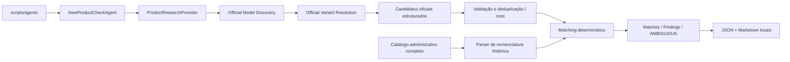

# New Product Check Agent — Discovery, Resolution e compatibilidade de nomenclatura

## Escopo e direção canônica

Sprint 19A.1, sobre a 19A ainda sem commit, no worktree
`C:\Dev\compra-car-agent1`, branch `sprint-19-new-product-agent`.
Base Git: `4d4840c33276845ddd62748847588e7e3b47073f`.

**Official naming is authoritative. Legacy Compra-Car naming is transitional.**
O agente aprende/extrai a linguagem comercial oficial e pode reconciliá-la com
nomes históricos. Nunca reescreve o catálogo nem monta um nome oficial artificial
a partir de atributos técnicos.

Exemplo: a fonte publica `XRE`; o catálogo tem `XRE 2.0 CVT`. O report preserva
ambos, separadamente. `Longitude T270 MHEV` não é convertido em
`Longitude 1.3 TGDI AT MHEV`.

Continua READ-ONLY: nenhuma alteração em products, specs, preços ou dados
comerciais; nenhuma migration, persistência de aliases/findings, UI ou scheduler.
Sem Price Agent, Spec Agent, Railway ou registry web Jeep.

## Arquitetura: um agente



`packages/core/src/agents` contém contratos, registry, validação, deduplicação,
parser, matcher, aplicação e fixtures. Sem imports de OpenAI ou banco.
`packages/adapter-openai` implementa pesquisa pela Responses API e schema strict.
`scripts/agents` compõe as dependências, valida argumentos e escreve relatórios.
A aplicação recebe apenas `ProductCatalogReader.readProducts` e
`ReportWriter.write`; não recebe capacidade de mutação canônica.

Discovery e Resolution são **duas tarefas na mesma chamada estruturada** nesta
Sprint. O prompt exige enumerar modelos e, para cada um, procurar fontes de
variantes antes de responder. O array final contém variantes resolvidas ou um
candidato MODEL quando a resolução não for possível. Não há dois agentes,
scheduler ou fan-out de chamadas por modelo.

O provider extrai fatos; o core decide identidade e classificação. O catálogo
não é enviado ao LLM. Nenhum juízo do provider sobre novidade ou equivalência
é aceito como decisão de matching.

## Contrato oficial

`OfficialProductCandidate`:

```typescript
{
  brand: string;
  model: string; // modelo base explicitamente identificado
  taxonomy: 'MODEL' | 'VARIANT' | 'POWERTRAIN' | 'LANDING_PAGE' | 'UNKNOWN';
  officialVersionLabel: string | null; // nome publicado, preservado
  trim: string | null;
  powertrainLabel: string | null;
  engineDisplacement: number | null; // litros explícitos
  engineLabel: string | null;
  propulsion: 'ICE' | 'MHEV' | 'HEV' | 'PHEV' | 'BEV' | null;
  transmission: string | null;
  drivetrain: string | null;
  productionYear: number | null;
  modelYear: number | null;
  confidence: number;
  evidence: ProductEvidence[];
  extractionWarnings?: ExtractionWarning[];
}
```

`version` foi substituído por `officialVersionLabel`. Valores oficiais são
preservados, inclusive casing; `vehicleTextComparisonKey` é usado na comparação.
Não se concatena trim + cilindrada + transmissão para formar um rótulo oficial.

Evidence contém URL, title, excerpt curto e evidenceType nullable:
TECHNICAL_SHEET, VERSION_DOCUMENT, PRICE_LIST, CONFIGURATOR, MODEL_PAGE,
PRESS_RELEASE ou OTHER_OFFICIAL. Cada fato extraído precisa ser sustentado
pelas evidências do candidato; o operador deve conferir as fontes.

No JSON Schema de transporte, todos os campos são obrigatórios, com null onde
apropriado e `extractionWarnings: []` sem dúvidas. Objetos não aceitam propriedades
livres. Valores de preço ou uma propriedade legacy `version` são rejeitados.
O core também valida estrutura, limites e URLs e projeta apenas campos permitidos.

## Fontes e resolução

Registry apenas Toyota/BR:

- Domain filters da pesquisa: `toyota.com.br`, `media.toyota.com.br`.
- Hosts aceitos localmente: `toyota.com.br`, `www.toyota.com.br`,
  `media.toyota.com.br`. Outros subdomínios não são implicitamente autorizados.
- HTTPS obrigatório; credenciais em URL, porta não padrão, host falso, terceiros
  e concessionários independentes são rejeitados pelo parser de URL/hostname.
- Fragmentos são removidos; não se usa `.includes("toyota.com.br")`.

Prioridade instruída para resolução: ficha técnica → documento de versões →
lista oficial de preços **somente para identidade** → configurador → página de
modelo → release oficial atual. Não se extrai preço para uso comercial.

MODEL e VARIANT exigem identificação do modelo base. POWERTRAIN, LANDING_PAGE
e UNKNOWN resultam em AMBIGUOUS. Uma rota Corolla Cross Hybrid não vira um modelo
novo automaticamente. Não há remoção genérica de tokens: Corolla Cross e Corolla
podem ser modelos distintos, e GR Corolla pode ser um modelo próprio.

Candidato sem evidência oficial é rejeitado antes de gerar match ou finding.
Fontes externas não são salvas; `rejectedExternalSources` conta suas ocorrências
nos candidatos estruturalmente válidos. Não conta todas as páginas visitadas
internamente pela ferramenta. Rejeições guardam índice e motivo.

## Catálogo administrativo e parser legado

A leitura continua via `AdministrativeProductCatalogReader` →
`CommercialOperatorCatalogReader` →
`LegacySupabaseAdapter.listOperatorMatchingProducts()`.
Inclui Public, Private, Active e Inactive, sem filtro de ano ou Seller Catalog.
Retém id, brand, model, version, productionYear, modelYear, isActive e isPublic.

O SELECT existente pagina por id, verifica contagem, usa timeout de 15 s/página
e limite de 10.000 registros do catálogo completo; o core filtra a marca
normalizada após a leitura. Nenhum código SQL ou acesso Supabase foi adicionado.

`parseLegacyProductVersion` interpreta somente padrões pequenos e explícitos:

| Componente | Regra |
| --- | --- |
| Trim | Prefixo anterior ao primeiro atributo reconhecido; rótulo inteiro se não há atributos |
| Cilindrada | Token decimal de um dígito + ponto + um dígito, positivo |
| Propulsão explícita | ICE, MHEV, HEV, PHEV, BEV; EV equivale a BEV |
| Transmissão | CVT, AT, DHT, MT |
| Tração | 4x4, 4x2, AWD, FWD, RWD, 2WD, 4WD, sem equivalências implícitas |
| Engine label | TGDI; também retido em extraTokens |
| Powertrain label | Token T seguido de três dígitos, com marcador elétrico explícito quando presente |
| Desconhecidos | Permanecem desconhecidos/extraTokens; sufixo não interpretado bloqueia match seguro |

**Convenção de transição ICE:** nome histórico expandido com cilindrada +
CVT/AT/MT, sem marcador elétrico, sem conflito e sem sufixo desconhecido,
é interpretado como ICE. Isso permite separar Yaris Cross XRE 1.5 CVT de
XRE 1.5 HEV CVT. O parser registra `propulsionBasis=LEGACY_EXPANDED_CONVENTION`.
Essa convenção não infere nem altera a propulsão do candidato oficial.
DHT sem marcador explícito, nomes curtos e sufixos desconhecidos mantêm
propulsão unknown. Tokens conflitantes impedem reconciliação automática.

Não há mapa T270 → 1.3 TGDI: no exemplo Jeep, powertrainLabel pode estar ausente
no registro legado, enquanto trim e MHEV são comparáveis. A regra de ausência
e unicidade decide a compatibilidade, sem tradução do nome comercial.

## Regras de matching e precedência

Confidence representa extração. Menor que 0.65 ou warnings de fonte/alias/pacote/
evidência geram AMBIGUOUS; não há threshold de escrita automática.

1. Taxonomia incerta ou evidência/extração insuficiente → AMBIGUOUS
   (ausência de URL oficial já foi rejeitada na aplicação).
2. Modelo explicitamente identificado e ausente por comparação normalizada
   → **NEW_MODEL, mesmo com officialVersionLabel e trim null**.
3. Modelo conhecido e variante não resolvida → AMBIGUOUS, reason:
   `Model is known, but official variant could not be resolved.`
4. VARIANT com officialVersionLabel ou trim explícito → reconciliação.
5. Compare rótulo oficial direto ou trim literal com registros históricos.
   Todos os componentes presentes em ambos os lados devem ser compatíveis.
   Ausência não é conflito; divergência explícita é conflito.
6. Exatamente um registro compatível e nenhuma alternativa ainda incerta
   → match; mais de um → AMBIGUOUS.
7. Correspondência parcial com conflito → AMBIGUOUS. Nenhuma variante
   reconciliável, nenhuma suspeita de nomenclatura e evidência suficiente
   → NEW_VERSION.

Modos:

- **EXACT_OFFICIAL:** rótulo oficial igual à versão canônica normalizada,
  com componentes compatíveis e unicidade.
- **LEGACY_NAMING:** trim/composição histórica compatíveis, com unicidade.
  O catálogo e o rótulo oficial continuam intactos.

Apenas `Direct Shift CVT` / `Direct-Shift CVT` têm equivalência explícita a CVT
na comparação. Prefixos e pontuação podem levantar suspeita para AMBIGUOUS,
mas nunca declarar match. Não há Levenshtein, embeddings, similaridade semântica
ou julgamento do LLM para resolver identidade.

Anos só são comparados **depois da reconciliação única**. Divergência explícita
gera POSSIBLE_YEAR_CHANGE com matchMode e registro correspondente. Anos ausentes
permanecem null; data de documento/PDF/URL/execução não é ano do produto.
Anos não desempatarão múltiplos registros compatíveis, inclusive históricos.

## Deduplicação e relatório

Identidade oficial normalizada: mercado, marca, modelo, officialVersionLabel,
trim quando não existe label, propulsão e powertrainLabel. Engine, transmission
e anos não são obrigatórios na chave. Fingerprint usa tupla JSON versionada
`new-product-check:v2`, acrescida do finding type.

Observações com a mesma identidade unem evidências e campos complementares.
Divergências de componentes/anos geram CONFLICTING_SOURCES; a primeira observação
não nula é mantida para exibição, com todas as evidências disponíveis para revisão.
Uma observação sem propulsão/powertrain pode unir-se a uma única identidade mais
completa. Se houver ICE e HEV possíveis, ela permanece AMBIGUOUS, sem unir os grupos.
Repetições exatas de evidências são deduplicadas; trechos distintos na mesma URL
são preservados para auditoria.

O JSON `schemaVersion: 19A.1` mantém matches, findings, ids e nomes históricos
dos produtos considerados, candidatos oficiais, evidências e telemetria.
O Markdown mostra contagens e seções Matches / Findings / AMBIGUOUS.
Cada resultado tem tabela vertical de atributos e correspondências canônicas,
evitando uma tabela excessivamente larga.

`modelsDiscovered` conta modelos normalizados distintos em candidatos aceitos
MODEL/VARIANT. `variantsResolved` conta candidatos VARIANT com label ou trim;
não significa que todos foram reconciliados. Demais estados são contados por
matchMode e finding type. Rejeitados não entram nessas contagens.

Relatórios exclusivos por run ID:
`.local-reports/agents/new-product-check/<run-id>.{json,md}`, ignorados pelo Git.
Sem HTML completo; excerpts de até 300 caracteres. Secrets conhecidos são
removidos antes dos dois formatos. Erros brutos do SDK/banco não são impressos.
Erro ao escrever gera exit != 0; falha no segundo arquivo pode deixar o primeiro.

## Execução e validação

Na raiz do worktree:

```powershell
pnpm agent:new-products:dry-run -- --brand Toyota --provider fixture
```

Fixture sintética: 8 registros administrativos, 11 candidatos, 3 modelos,
9 variantes resolvidas, 8 matches LEGACY_NAMING, SW4 como NEW_MODEL,
GR-Sport como NEW_VERSION e Corolla Cross sem variante como AMBIGUOUS.
POSSIBLE_YEAR_CHANGE é coberto em teste separado, sem duplicar artificialmente
o mesmo candidato no fixture principal.

OpenAI exige OPENAI_API_KEY, OPENAI_AGENT_MODEL, SUPABASE_URL e SUPABASE_SERVER_KEY
no ambiente do processo; o CLI não carrega .env automaticamente. Não há modelo
default. SDK 6.49.0 existente, timeout 120 s, sem retries, web search obrigatório,
schema strict, validação Ajv, logs desligados e `store: false`.
Telemetria opcional preservada: provider/model/responseId/tokens/webSearchCount.
Não há cálculo monetário.

**Nesta entrega, somente fixture. Não executar o provider OpenAI automaticamente.**
O próximo smoke real da revisão 19A.1 depende de autorização manual posterior.
Nenhuma chamada real é feita pelos testes da Sprint; transporte simulado e rede
bloqueada nesses testes. Gates e evidência real da fixture:
[SPRINT_19A_VALIDATION.md](SPRINT_19A_VALIDATION.md).

## Limitações e futuro

- **PENDENTE:** smoke real 19A.1 autorizado após revisão. O smoke anterior,
  informado pelo operador, descobriu 16 candidatos apenas de modelo; não prova
  que a nova resolução encontrará todas as variantes.
- Taxonomia, atualidade e fatos são extraídos pelo provider. URL oficial válida
  não prova fidelidade, cobertura completa, conteúdo atual ou ausência de redirects.
  A Sprint não baixa nem verifica páginas independentemente.
- Parser propositalmente limitado e convenção ICE transitória: nomes fora dos
  padrões podem exigir revisão. Campo ausente não prova equivalência técnica.
- A consulta existente não é snapshot transacional. Mudanças concorrentes com
  contagem estável podem passar; não há cópia completa do catálogo para replay.
- Reports antigos 19A permanecem intactos, com schema anterior; sem migração.
- Ambiente de validação: Node 24.18.0, embora o projeto declare Node 22.x.

Roadmap: 19A dry-run → 19B persistence + review → 19C scheduled worker →
Price Agent → Spec Agent, sem implementação dessas fases.

Futura **Catalog Naming Normalization Sprint**, somente documentada:
nome comercial oficial como label canônico; nomes históricos como aliases;
motor/transmissão/powertrain em atributos; migrations com revisão do operador;
nenhuma renomeação destrutiva em massa sem reconciliação. Pode ocorrer depois
do piloto ou com a Catalog Reconciliation Sprint.

Referências:
[OpenAI Structured Outputs](https://developers.openai.com/api/docs/guides/structured-outputs),
[OpenAI web search](https://developers.openai.com/api/docs/guides/tools-web-search).

