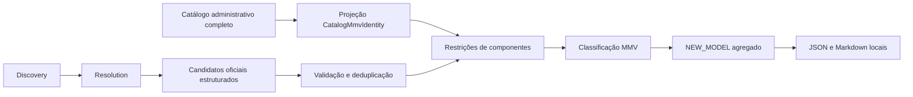

# New Product Check Agent — responsabilidade atual: MMV Discovery

## Escopo e decisão canônica

Sprint 19A.4, worktree `C:\Dev\compra-car-agent1`, branch
`sprint-19-new-product-agent`, HEAD inicial **8140a10**. O nome do código/CLI
é histórico; a missão agora é **descobrir e reconciliar Marca + Modelo + Versão**.

**Official naming is authoritative. Legacy Compra-Car naming is transitional.**
Rótulos oficiais e canônicos permanecem preservados. O agente não responde
quais MY oficiais estão observáveis; isso pertence ao Model Year Agent (Sprint 20).
Production Year fica fora da pesquisa desse agente downstream.

Default READ-ONLY: reports locais e zero escrita no banco. A Sprint 19B
adicionou --persist-findings como opt-in exclusivo de dados operacionais,
com o mesmo UUID do report e revisão Admin sem executar ações canônicas.
Migration aplicada no Staging conforme informado pelo operador; versão local
20260913224216 alinhada na 19B.1. [Plataforma 19B](AGENT_PLATFORM_19B.md).
Sem aliases table ou scheduler. Blueprint canônico dos cinco agentes:
[AGENT_PLATFORM_ARCHITECTURE.md](AGENT_PLATFORM_ARCHITECTURE.md).

## Pipeline



O provider extrai fatos, sem receber o catálogo. O core decide identidade.
Discovery/Resolution continuam duas tarefas na mesma resposta estruturada.
Provider, prompt, modelo configurado, estratégia e registry não foram alterados
na 19A.4. Nenhuma nova chamada OpenAI foi executada.

## Projeção do catálogo

`projectCatalogMmvIdentities` agrupa exatamente por marca + modelo + versão
canônica normalizados com `vehicleTextComparisonKey` (case/whitespace).
A chave `catalog-mmv:v1` é uma tupla JSON versionada; não inclui PY/MY,
id de row, Active ou Public. Rótulos históricos diferentes continuam MMVs
distintas, mesmo semanticamente parecidos.

`CatalogMmvIdentity` contém id, brand, model, canonicalVersionLabel,
normalizedBrand/Model/Version, parsedLegacyComponents e `productRows`.
Cada product row preserva id, nomes originais, productionYear, modelYear,
isActive e isPublic. Ordenação por anos/id é somente de apresentação.

A aplicação projeta o catálogo uma vez por execução e reconcilia candidatos
contra as identidades. A leitura continua via AdministrativeProductCatalogReader
e o contrato administrativo existente, incluindo Private/Inactive. Sem nova
consulta, tabela ou migration. O SELECT paginado existente permanece intacto.

## Restrições de identidade

Para mesmo brand/model, intersectar MMVs por:

1. trim;
2. propulsion;
3. engine displacement na precisão comum;
4. transmission family;
5. drivetrain.

Campo ausente em qualquer lado não cria conflito automaticamente. Incompatibilidade
explícita elimina a MMV. Zero sobreviventes com variante oficial resolvida →
NEW_VERSION; uma MMV segura → MATCHED; mais de uma identidade distinta →
AMBIGUOUS. Múltiplas rows da mesma MMV nunca geram ambiguidade por si só.

Taxonomia incerta, variante incompleta, contradições de fatos, evidência
insuficiente ou nomenclatura não interpretada continuam exigindo revisão.
Confidence < 0.65 e warnings não localizados de conflito/insuficiência são
conservadores em modelos conhecidos. Alias e pacote informativos não são
bloqueadores automáticos; possível alias para identidade existente ou pacote
ainda não resolvido pode exigir revisão.

EXACT_OFFICIAL exige igualdade do rótulo inteiro normalizado e unicidade MMV.
LEGACY_NAMING reconcilia estrutura histórica sem reescrever o nome oficial.
O resultado inclui uma MMV e **todas** as productRows associadas.

### Hard versus soft

Engine label e commercial powertrain label são metadados, não restrições rígidas
de igualdade textual com o legado. T270, T270 MHEV e Hurricane são preservados,
sem mapa para cilindrada. Literais estruturáveis já explícitos no powertrain,
como litros ou propulsão, podem contribuir como fatos disponíveis.

Um sufixo do trim histórico pode ser delimitado quando é literalmente o
powertrainLabel fornecido pelo candidato: trim Blackhawk + powertrain Hurricane
é compatível com o prefixo histórico Blackhawk Hurricane. A regra é genérica,
não conhece marcas/famílias e não remove palavras arbitrárias.

Prefixos/pontuação podem levantar dúvida, nunca estabelecer fuzzy matching.
Não há Levenshtein, embeddings, aliases table ou decisão de identidade pelo LLM.

### Precisão da cilindrada

O parser preserva o número de casas decimais do token canônico: 1.3 tem uma,
1.30 tem duas. Aceita tokens decimais explícitos; T270 não é cilindrada.

A comparação arredonda **ambos os valores à menor precisão disponível**,
com decimal half-up, usando decimal.js já existente. Não há epsilon ou tolerância
de distância. O número oficial vem de JSON e perde zeros finais; considera-se
no mínimo uma casa decimal e as demais casas efetivamente presentes.

| Oficial | Canônico | Precisão comum | Resultado |
| --- | --- | --- | --- |
| 1.332 | 1.3 | 1 | Compatível |
| 1.995 | 2.0 | 1 | Compatível |
| 2.184 | 2.2 | 1 | Compatível |
| 1.332 | 1.30 | 2 | Conflito |
| 1.332 | 1.334 | 3 | Conflito |
| 1.8 | 2.0 | 1 | Conflito |
| 1.3 | 1.5 | 1 | Conflito |
| 1.35 | 1.3 | 1 | Conflito (half-up = 1.4) |

Essa regra compara representação comercial/técnica, não prova equivalência
mecânica universal. Não infere 1.3 de T270 nem 2.0 de Hurricane.

### Parser, transmissão e tração

O parser histórico reconhece cilindrada decimal, propulsão explícita,
CVT/AT/MT/DHT, tração, códigos T seguidos de três dígitos e descritores TGDI/TD.
Sem marcador elétrico, cilindrada + câmbio convencional e sem sufixo desconhecido
mantêm a convenção transitória ICE-compatible. Ela não muda o nome oficial.

Famílias mantidas: CVT (inclusive Direct Shift/Multidrive), AT (Automática ou
Automático de N marchas/velocidades), MT (Manual), DHT. Hybrid Transaxle,
com ou sem (CVT), é compatibilidade histórica CVT somente para HEV. Número de
marchas não entra na identidade.

Tração ignora case em 4x4/4x2 e aceita a descrição explícita «com reduzida»
nesses rótulos. AWD/4WD/FWD etc. mantêm suas chaves; não foi inventada equivalência
AWD ↔ 4x4. Oficial 4x2 versus legado ausente não conflita; 4x4 versus 4x2 conflita.
Todos os valores brutos continuam no report.

## PY/MY e deduplicação

PY/MY não participa do agrupamento, filtros, desempate, classificação ou
fingerprint MMV. O agente **não emite POSSIBLE_YEAR_CHANGE**; o enum permanece
temporariamente para compatibilidade. MODEL_YEAR_MATCHED e NEW_MODEL_YEAR pertencem ao Model Year Agent.

Candidatos preservam seus campos PY/MY. Observações repetidas são unidas com
`yearObservations` contendo pares originais; diferenças apenas de ano não
geram CONFLICTING_SOURCES. O par escalar inicial é preservado, sem combinar
PY de uma fonte com MY de outra para inventar uma ocorrência.

A deduplicação mantém a identidade oficial da variante e evidências. Descrições
de engineLabel divergentes não geram conflito rígido. Cilindradas são comparadas
na precisão comum. Conflitos nos demais componentes estruturados continuam
auditáveis e sujeitos a revisão. Campos brutos retêm o primeiro valor;
evidências e observações de ano são unidas.

NEW_MODEL continua agregado por mercado/marca/modelo, com variantes deduplicadas,
todas as evidências válidas, warnings e maior confidence relevante. NEW_VERSION
permanece por variante. Hilux Cabine Dupla/Simples e Hiace/Hiace Furgão não são
fundidos. Fingerprints de findings v3 permanecem independentes de ano.

## Contratos, fontes e relatórios

OfficialProductCandidate preserva brand, model, taxonomy, officialVersionLabel,
trim, powertrainLabel, engineDisplacement, engineLabel, propulsion, transmission,
drivetrain, PY/MY, confidence, evidence e extractionWarnings. yearObservations
é adicionado localmente durante deduplicação, sem mudar o schema do provider.

As fontes continuam Toyota/BR e Jeep/BR. Toyota aceita somente os hosts exatos
toyota.com.br, www.toyota.com.br e media.toyota.com.br. Jeep aceita jeep.com.br
e subdomínios DNS por opt-in. Outros domínios Stellantis ficam fora.
HTTPS, hostname/credenciais/porta e escopo são revalidados; fontes externas são
descartadas. Taxonomia MODEL/VARIANT deve estabelecer o modelo; URL oficial
sozinha não prova fidelidade/atualidade.

JSON `schemaVersion: 19A.4` separa canonicalProductRows e knownMmvIdentities.
knownProducts permanece como alias depreciado do row count.
Matches e findings contêm matchedMmvIdentities; matchedProductIds/matchedProducts
continuam como visão plana das rows associadas, por compatibilidade.

Markdown apresenta MMV correspondente e, abaixo, product rows com anos/estados.
Ambiguidade mostra apenas MMVs sobreviventes e suas ocorrências. Contagens são
de candidatos oficiais reconciliados, não de rows. Seções de mudança de ano
não são conclusões deste agente.

Reports exclusivos por run id ficam em .local-reports/agents/new-product-check,
ignorados pelo Git. Secrets conhecidos são removidos dos dois formatos,
inclusive de estruturas aninhadas. Falhas operacionais retornam exit != 0;
falha no segundo arquivo pode deixar o primeiro.

## Execução e limites

```powershell
pnpm agent:new-products:dry-run -- --brand Toyota --provider fixture
pnpm agent:new-products:dry-run -- --brand Jeep --provider fixture
```

Fixtures originais permanecem: Toyota 8/8 MMVs; Jeep pequena 4/4.
A regressão adicional usa os 18 candidatos da run Jeep
2506bcb5-7ff7-4529-bbd2-29b51efd5778, com 6 product rows preservadas e 10
reconstruídas dos casos de aceitação. São 16 rows / 13 MMVs, **não um snapshot
completo das 51 rows da run original**. Resultado: 13 matches e 3 NEW_MODEL.

PENDENTE: replay com snapshot completo para verificar todas as possíveis
identidades concorrentes; run real somente após revisão/autorização. Zero novas
chamadas OpenAI na 19A.4. O provider existente exige configuração explícita,
sem modelo default; sua implementação não mudou.

Parser/normalização continuam conservadores; dados faltantes não provam
equivalência técnica. A consulta existente não é snapshot transacional.
Node de validação 24.18.0 versus 22.x declarado. Gates globais preexistentes
são detalhados na validação.

[Benchmark](CROSS_BRAND_BENCHMARK.md) · [Validação](SPRINT_19A_VALIDATION.md).
