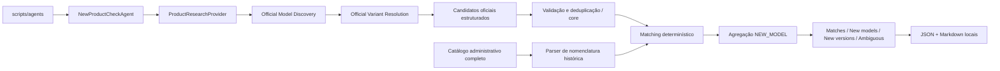

# New Product Check Agent — Discovery, Resolution e compatibilidade de nomenclatura

## Escopo e direção canônica

Sprint 19A.3 no worktree
`C:\Dev\compra-car-agent1`, branch `sprint-19-new-product-agent`.
Base Git: `cf041ee` (19A.2 já commitada pelo operador).

**Official naming is authoritative. Legacy Compra-Car naming is transitional.**
O agente aprende/extrai a linguagem comercial oficial e pode reconciliá-la com
nomes históricos. Nunca reescreve o catálogo nem monta um nome oficial artificial
a partir de atributos técnicos.

Exemplo: a fonte publica `XRE`; o catálogo tem `XRE 2.0 CVT`. O report preserva
ambos, separadamente. `Longitude T270 MHEV` não é convertido em
`Longitude 1.3 TGDI AT MHEV`.

Continua READ-ONLY: nenhuma alteração em products, specs, preços ou dados
comerciais; nenhuma migration, persistência de aliases/findings, UI ou scheduler.
Sem Price Agent, Spec Agent, Railway ou terceira marca.

## Arquitetura: um agente



`packages/core/src/agents` contém contratos, registry, validação, deduplicação,
parser, matcher, aplicação e fixtures. Sem imports de OpenAI ou banco.
`packages/adapter-openai` implementa pesquisa pela Responses API e schema strict.
`scripts/agents` compõe as dependências, valida argumentos e escreve relatórios.
A aplicação recebe apenas `ProductCatalogReader.readProducts` e
`ReportWriter.write`; não recebe capacidade de mutação canônica.

Discovery e Resolution são **duas tarefas na mesma chamada estruturada** nesta
Sprint. O prompt exige enumerar modelos e, para cada um, procurar fontes de
variantes antes de responder. O array final contém variantes resolvidas ou um
candidato MODEL quando a resolução não for possível. Não há dois agentes,
scheduler ou fan-out de chamadas por modelo.

O provider extrai fatos; o core decide identidade e classificação. O catálogo
não é enviado ao LLM. Nenhum juízo do provider sobre novidade ou equivalência
é aceito como decisão de matching.

## Contrato oficial

`OfficialProductCandidate`:

```typescript
{
  brand: string;
  model: string; // modelo base explicitamente identificado
  taxonomy: 'MODEL' | 'VARIANT' | 'POWERTRAIN' | 'LANDING_PAGE' | 'UNKNOWN';
  officialVersionLabel: string | null; // nome publicado, preservado
  trim: string | null;
  powertrainLabel: string | null;
  engineDisplacement: number | null; // litros explícitos
  engineLabel: string | null;
  propulsion: 'ICE' | 'MHEV' | 'HEV' | 'PHEV' | 'BEV' | null;
  transmission: string | null;
  drivetrain: string | null;
  productionYear: number | null;
  modelYear: number | null;
  confidence: number;
  evidence: ProductEvidence[];
  extractionWarnings?: ExtractionWarning[];
}
```

`version` foi substituído por `officialVersionLabel`. Valores oficiais são
preservados, inclusive casing; `vehicleTextComparisonKey` é usado na comparação.
Não se concatena trim + cilindrada + transmissão para formar um rótulo oficial.

Evidence contém URL, title, excerpt curto e evidenceType nullable:
TECHNICAL_SHEET, VERSION_DOCUMENT, PRICE_LIST, CONFIGURATOR, MODEL_PAGE,
PRESS_RELEASE ou OTHER_OFFICIAL. Cada fato extraído precisa ser sustentado
pelas evidências do candidato; o operador deve conferir as fontes.

No JSON Schema de transporte, todos os campos são obrigatórios, com null onde
apropriado e `extractionWarnings: []` sem dúvidas. Objetos não aceitam propriedades
livres. Valores de preço ou uma propriedade legacy `version` são rejeitados.
O core também valida estrutura, limites e URLs e projeta apenas campos permitidos.

## Fontes e resolução

Registry declarativo por marca/mercado:

| Marca / BR | Domain filters | Validação local |
| --- | --- | --- |
| Toyota | toyota.com.br, media.toyota.com.br | Somente toyota.com.br, www.toyota.com.br e media.toyota.com.br |
| Jeep | jeep.com.br | Domínio raiz e subdomínios DNS de jeep.com.br por opt-in |

`allowedHosts` mantém hosts exatos; `allowedSubdomainRoots` autoriza explicitamente
um domínio configurado em allowedDomains e seus subdomínios. A comparação é por
hostname exato ou sufixo `.` + domínio, com validação dos labels DNS; não usa
includes. HTTPS obrigatório, sem credenciais, porta não padrão ou hosts falsos;
fragmentos são removidos. A regra Toyota de hosts exatos não foi ampliada.

Jeep recebe hints de versões, ficha técnica, monte o seu, configurador, motor,
powertrain, T270, T270 MHEV, Hurricane, Hurricane Flex, ano modelo e Jeep Brasil.
Não há mapeamento desses nomes para cilindrada. Nenhum domínio Stellantis
externo foi autorizado. Eventual fonte essencial fora de jeep.com.br deverá
ser documentada como candidata e revisada antes de inclusão.

O provider recebe a política de hosts e hints do registry no input. O prompt
deixou de fixar consultas site:toyota.com.br; usa searchHints/allowedDomains
da marca selecionada. Responses, modelo configurado, schema e estratégia
Discovery/Resolution permanecem iguais.

Prioridade instruída para resolução: ficha técnica → documento de versões →
lista oficial de preços **somente para identidade** → configurador → página de
modelo → release oficial atual. Não se extrai preço para uso comercial.

MODEL e VARIANT exigem identificação do modelo base. POWERTRAIN, LANDING_PAGE
e UNKNOWN resultam em AMBIGUOUS. Uma rota Corolla Cross Hybrid não vira um modelo
novo automaticamente. Não há remoção genérica de tokens: Corolla Cross e Corolla
podem ser modelos distintos, e GR Corolla pode ser um modelo próprio.

Candidato sem evidência oficial é rejeitado antes de gerar match ou finding.
Fontes externas não são salvas; `rejectedExternalSources` conta suas ocorrências
nos candidatos estruturalmente válidos. Não conta todas as páginas visitadas
internamente pela ferramenta. Rejeições guardam índice e motivo.

## Catálogo administrativo e parser legado

A leitura continua via `AdministrativeProductCatalogReader` →
`CommercialOperatorCatalogReader` →
`LegacySupabaseAdapter.listOperatorMatchingProducts()`.
Inclui Public, Private, Active e Inactive, sem filtro de ano ou Seller Catalog.
Retém id, brand, model, version, productionYear, modelYear, isActive e isPublic.

O SELECT existente pagina por id, verifica contagem, usa timeout de 15 s/página
e limite de 10.000 registros do catálogo completo; o core filtra a marca
normalizada após a leitura. Nenhum código SQL ou acesso Supabase foi adicionado.

`parseLegacyProductVersion` interpreta somente padrões pequenos e explícitos:

| Componente | Regra |
| --- | --- |
| Trim | Prefixo anterior ao primeiro atributo reconhecido; rótulo inteiro se não há atributos |
| Cilindrada | Token decimal de um dígito + ponto + um dígito, positivo |
| Propulsão explícita | ICE, MHEV, HEV, PHEV, BEV; EV equivale a BEV |
| Transmissão | CVT, AT, DHT, MT |
| Tração | 4x4, 4x2, AWD, FWD, RWD, 2WD, 4WD, sem equivalências implícitas |
| Engine label | TGDI; também retido em extraTokens |
| Powertrain label | Token T seguido de três dígitos, com marcador elétrico explícito quando presente |
| Desconhecidos | Permanecem desconhecidos/extraTokens; sufixo não interpretado bloqueia match seguro |

**Convenção de transição ICE:** nome histórico expandido com cilindrada +
CVT/AT/MT, sem marcador elétrico, sem conflito e sem sufixo desconhecido,
é interpretado como ICE. Isso permite separar Yaris Cross XRE 1.5 CVT de
XRE 1.5 HEV CVT. O parser registra `propulsionBasis=LEGACY_EXPANDED_CONVENTION`.
Essa convenção não infere nem altera a propulsão do candidato oficial.
DHT sem marcador explícito, nomes curtos e sufixos desconhecidos mantêm
propulsão unknown. Tokens conflitantes impedem reconciliação automática.

Não há mapa T270 → 1.3 TGDI: no exemplo Jeep, powertrainLabel pode estar ausente
no registro legado, enquanto trim e MHEV são comparáveis. A regra de ausência
e unicidade decide a compatibilidade, sem tradução do nome comercial.

## Regras de matching e precedência

1. Validar estrutura, escopo e evidência oficial; candidato sem URL oficial é
   rejeitado. MODEL/VARIANT devem identificar um modelo base; as demais taxonomias
   não estabelecem sozinhas a existência de um modelo.
2. Modelo explícito ausente → **NEW_MODEL antes da incerteza de variante**.
   Alias, pacote, conflito de nomes, versão incompleta ou confidence baixa da
   variante permanecem anexados, sem ocultar a descoberta do modelo.
3. Para modelo conhecido, começar com todos os produtos da mesma marca/modelo e
   intersectar as restrições disponíveis: trim → propulsão → cilindrada →
   família de transmissão → tração. Códigos explícitos de powertrain também
   eliminam incompatíveis; descrições opacas divergentes exigem revisão.
4. Campo oficial ausente não filtra. Campo histórico ausente não é conflito.
   Valores conhecidos incompatíveis eliminam o registro, sem reapresentá-lo nas
   correspondências do relatório.
5. Com identidade oficial suficiente: zero sobreviventes → **NEW_VERSION**;
   um sobrevivente seguro → match; mais de um → **AMBIGUOUS**. Nunca escolher
   por ordem, ano ou visibilidade. Variante não resolvida continua AMBIGUOUS.

Warnings de extração são distintos da classificação:

- POSSIBLE_ALIAS é informativo quando nenhum registro corresponde: GRS pode ser
  NEW_VERSION. Se a evidência mencionar literalmente outro trim canônico possível,
  essa correspondência permanece para revisão; não há mapa GRS → GR-Sport.
- POSSIBLE_PACKAGE com evidência estruturada (ficha, documento de versões,
  lista de preços ou configurador) pode gerar NEW_VERSION. GRS Dualtone em linha
  comercial própria preserva o warning. Se ainda houver um produto do mesmo trim,
  ou faltar evidência estruturada, a identidade do pacote exige revisão.
- CONFLICTING_SOURCES e INSUFFICIENT_EVIDENCE não trazem escopo de atributo no
  contrato atual. Em modelo conhecido, são tratados conservadoramente como fatos
  de identidade ainda não resolvidos, assim como confidence < 0.65, contradições
  entre fatos estruturados e nomes históricos não interpretáveis. Em modelo
  ausente explicitamente identificado, ficam nas variantes do NEW_MODEL.
- Um warning de alias não impede um match único comprovado pelos componentes.

EXACT_OFFICIAL exige igualdade normalizada do **rótulo inteiro** com a versão
canônica, compatibilidade e unicidade. LEGACY_NAMING usa decomposição histórica
compatível; nomes oficiais e canônicos permanecem intactos. Prefixos e pontuação
podem levantar suspeita, nunca estabelecer equivalência. Não há fuzzy matching,
Levenshtein, embeddings ou decisão de identidade pelo LLM.

### Famílias de componentes

A normalização existe somente para comparação e deduplicação; `transmission`
continua contendo o rótulo oficial bruto.

| Entrada explícita | Família de comparação |
| --- | --- |
| CVT, Direct Shift CVT, Direct Shift (CVT), CVT Multidrive, CVT Multidrive sequencial | CVT |
| AT, Automática, Automática de 6 velocidades, com ou sem sequencial | AT |
| MT, Manual, Manual de 6 velocidades | MT |
| DHT | DHT |
| Hybrid Transaxle, Hybrid Transaxle (CVT), somente com HEV | CVT, **legacy transmission compatibility** |
| Hybrid, Híbrido | HEV |
| ICE, MHEV, HEV, PHEV, BEV explícitos | Respectiva família, sem colapsar MHEV/PHEV |
| Electric, EV, Elétrico | BEV somente com contexto explícito puramente elétrico |
| 2.0L, 2 L, 2.0 | Número 2; nunca equivalente a 1.8 |

O schema do provider continua exigindo propulsão enum e cilindrada numérica.
Aliases de propulsão e litros textuais são interpretados no powertrain explícito
durante a comparação. Isso não reescreve o candidato. Códigos como T270 não
implicam cilindrada. Famílias desconhecidas ou contraditórias não são adivinhadas.

Anos só são comparados **depois da reconciliação única**. Divergência explícita
gera POSSIBLE_YEAR_CHANGE com matchMode e apenas o registro reconciliado.
Ausência permanece null; data de documento, URL ou execução não é ano do produto.
Anos não desempatarão múltiplos registros históricos.

## Deduplicação, agregação e relatório

A identidade de variante continua incluindo mercado, marca, modelo, rótulo
oficial (ou trim quando não há label), propulsão e powertrain normalizados.
Observações repetidas unem campos complementares e evidências. Conflitos
mantêm o primeiro valor não nulo e CONFLICTING_SOURCES para revisão; confidence
da variante deduplicada é o menor valor observado. Ausência de propulsão/powertrain
pode unir-se a uma única identidade mais completa, nunca unir ICE e HEV distintos.

Depois da classificação, NEW_MODEL é agregado por **mercado + marca normalizada +
modelo normalizado**. Seu fingerprint v3 não inclui versão. NEW_VERSION e demais
findings continuam com fingerprint de variante. Hilux Cabine Dupla/Simples e
Hiace/Hiace Furgão preservam identidades separadas conforme extraídas.

O finding NEW_MODEL contém um `candidate` de nível MODEL, sem atributos de
variante inventados, e `variants` com todas as variantes deduplicadas, inclusive
observações incompletas para revisão. Evidências válidas de todas as observações
do modelo são unidas e deduplicadas. Confidence do modelo é o **maior valor
relevante** entre suas observações MODEL/VARIANT; não estima novidade. Warnings
ficam nas variantes e no campo `warnings` agregado. Uma observação de taxonomia
incerta só é anexada quando outra observação estabelece aquele modelo.

O JSON `schemaVersion: 19A.2` mantém candidatos brutos, evidências, telemetria,
ids e versões canônicas apenas dos sobreviventes, além de `variants` e `warnings`.
Nos findings que não são NEW_MODEL, `variants` é vazio. O Markdown separa Matches,
New models (uma entrada por modelo, com variantes), New versions, Possible year
changes e Ambiguous. Avisos aparecem também em matches para auditoria.

`modelsDiscovered` conta modelos normalizados distintos em candidatos aceitos
MODEL/VARIANT. `variantsResolved` conta VARIANT com label ou trim e não significa
reconciliação. Contagens de findings já refletem a agregação. Rejeitados não
entram nessas contagens. Evidências iguais colapsam; trechos distintos na mesma
URL são preservados para auditoria.

Relatórios exclusivos por run ID:
`.local-reports/agents/new-product-check/<run-id>.{json,md}`, ignorados pelo Git.
Sem HTML completo; excerpts de até 300 caracteres. Secrets conhecidos são
removidos antes dos dois formatos, inclusive das variantes anexadas. Erros
brutos do SDK/banco não são impressos. Falha no segundo arquivo pode deixar o
primeiro; exit != 0 informa erro de escrita.

## Execução e validação

Na raiz do worktree:

```powershell
pnpm agent:new-products:dry-run -- --brand Toyota --provider fixture
pnpm agent:new-products:dry-run -- --brand Jeep --provider fixture
```

Fixture sintética: 8 registros administrativos, 21 candidatos, 5 modelos,
20 variantes resolvidas, 8 matches LEGACY_NAMING, 3 NEW_MODEL agregados
(Corolla: 5 variantes; SW4: 3; RAV4: 2), 2 NEW_VERSION (GRS e GRS Dualtone)
com warnings e 1 AMBIGUOUS (Corolla Cross sem variante). PY/MY ausentes na
fixture; POSSIBLE_YEAR_CHANGE é coberto por testes próprios.

Jeep fixture: 4 registros administrativos, 8 candidatos, 3 modelos, 7 variantes
resolvidas, 4 LEGACY_NAMING, 1 NEW_MODEL Commander (duas variantes), 1 NEW_VERSION
Blackhawk Hurricane Flex e 1 AMBIGUOUS Compass sem variante. T270/Hurricane não
implicam cilindrada; os componentes técnicos só entram quando explícitos.

Ambas as fixtures alcançam 100% de reconciliação e zero falsos novos conhecidos.
O CLI imprime métricas de benchmark somente em fixture, com gabarito independente;
o JSON/Markdown compartilhado permanece no schema 19A.2. Métricas, denominadores,
limites e extensão futura: [CROSS_BRAND_BENCHMARK.md](CROSS_BRAND_BENCHMARK.md).

OpenAI exige OPENAI_API_KEY, OPENAI_AGENT_MODEL, SUPABASE_URL e SUPABASE_SERVER_KEY
no ambiente do processo; o CLI não carrega .env automaticamente. Não há modelo
default. SDK 6.49.0 existente, timeout 120 s, sem retries, web search obrigatório,
schema strict, validação Ajv, logs desligados e `store: false`.
Telemetria opcional preservada: provider/model/responseId/tokens/webSearchCount.
Não há cálculo monetário.

**Nesta entrega, somente fixture. Não executar o provider OpenAI automaticamente.**
Não há chamada OpenAI real autorizada no escopo 19A.3. A run real Jeep
permanece PENDENTE de revisão e autorização posterior.
Nenhuma chamada real é feita pelos testes da Sprint; transporte simulado e rede
bloqueada nesses testes. Gates e evidência real da fixture:
[SPRINT_19A_VALIDATION.md](SPRINT_19A_VALIDATION.md).

## Limitações e futuro

- Toyota: o operador informou um smoke real posterior validado com 10 modelos,
  30 variantes resolvidas, 32 candidatos, 8 LEGACY_NAMING, 8 NEW_MODEL,
  2 NEW_VERSION e zero ambiguidades/rejeições. Não foi reexecutado nesta Sprint.
- Jeep: validação real cross-brand PENDENTE; fixture não prova a linha atual.
- O smoke 19A.1 informado pelo operador (run 64682aee-12c8-49f1-92d0-e6efd3ccf431)
  já forneceu 36 variantes em 11 modelos. Foi consultado somente como arquivo
  local. Seus oito produtos conhecidos têm PY 2026 contra PY 2025 no catálogo
  salvo: compatibilidade de identidade não remove POSSIBLE_YEAR_CHANGE.
- **PENDENTE:** gates globais preexistentes e revisão humana dos findings.
  Nenhuma nova consulta remota ou validação de disponibilidade nesta Sprint.
- Taxonomia, atualidade e fatos são extraídos pelo provider. URL oficial válida
  não prova fidelidade, cobertura completa, conteúdo atual ou ausência de redirects.
  A Sprint não baixa nem verifica páginas independentemente.
- Parser propositalmente limitado e convenção ICE transitória: nomes fora dos
  padrões podem exigir revisão. Campo ausente não prova equivalência técnica.
- A consulta existente não é snapshot transacional. Mudanças concorrentes com
  contagem estável podem passar; não há cópia completa do catálogo para replay.
- Reports antigos 19A permanecem intactos, com schema anterior; sem migração.
- Ambiente de validação: Node 24.18.0, embora o projeto declare Node 22.x.

Roadmap: 19A dry-run → 19B persistence + review → 19C scheduled worker →
Price Agent → Spec Agent, sem implementação dessas fases.

Futura **Catalog Naming Normalization Sprint**, somente documentada:
nome comercial oficial como label canônico; nomes históricos como aliases;
motor/transmissão/powertrain em atributos; migrations com revisão do operador;
nenhuma renomeação destrutiva em massa sem reconciliação. Pode ocorrer depois
do piloto ou com a Catalog Reconciliation Sprint.

Referências:
[OpenAI Structured Outputs](https://developers.openai.com/api/docs/guides/structured-outputs),
[OpenAI web search](https://developers.openai.com/api/docs/guides/tools-web-search).

