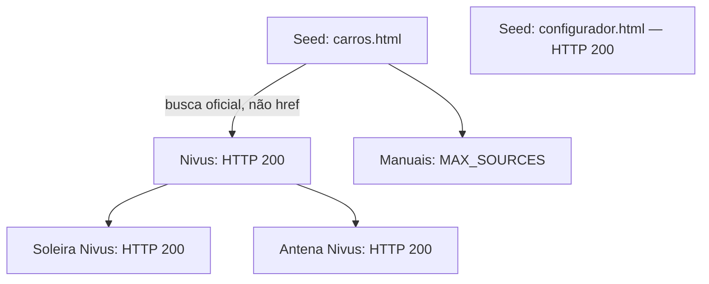

# Sprint 21.2 — Resultado do único gate real

## Conclusão

**Gate parcial: descoberta da página Nivus demonstrada; fonte técnica MY2026 e extração de fatos não demonstradas.** Execução encerrada após um smoke. Nenhuma correção funcional ou nova pesquisa foi feita depois do resultado. Aguardar revisão.

Alvo: VW / Nivus / Comfortline 200 TSI / catálogo Comfortline 1.0 TGDI AT / MY2026. Discovery dependency: 36c6d79b-45ca-49a6-abaa-66bd86d81d95. Connector ACTIVE: ed158a52-caf4-4688-a17f-28edbabb5d75.

## Respostas obrigatórias

1. **Página Nivus: sim**, HTTP 200, obtida por uma busca oficial limitada. O índice real não continha um href Nivus comprovável.
2. **Aplicabilidade exata: não comprovada.** O configurador genérico retornou 200; sua classificação não prova Comfortline MY2026.
3. **Fonte técnica MY2026: não.** O índice de manuais ficou em MAX_SOURCES; nenhum manual Nivus MY26 foi alcançado.
4. **Observações técnicas: zero.** Os cinco documentos produziram NO_BOUND_TECHNICAL_FACTS.
5. **EXACT_VERSION: nenhuma observação.**
6. **MODEL_SHARED / VERSION_MATRIX: nenhuma observação.**
7. **Vazamento Highline/GTS/Sense: nenhum observado**, com a ressalva de que a extração real produziu zero fatos.
8. **Jeep + Toyota: arquitetura genérica e testes offline presentes, mas ainda não recomendo ampliar o smoke real.** Corrigir a priorização de finalidade e a distribuição do orçamento antes de outra rodada autorizada. Nenhuma pesquisa real dessas marcas foi executada.

## Limitação funcional encontrada

A fila prioriza páginas OFFICIAL_HTML com sinal lexical MODEL_NAME. Duas páginas de produtos acessórios Nivus receberam essa preferência e consumiram os slots finais antes do índice de manuais. Isso é uma falha de priorização/cobertura, não evidência de ausência de dados técnicos VW. O grafo também classificou um PDF institucional ESG como candidato técnico por extensão/contexto; ele não foi buscado (MAX_SOURCES). A classificação de finalidade precisa ser mais precisa.

Próximo ajuste mínimo proposto, não implementado após o smoke: reduzir/excluir a prioridade de produtos acessórios e documentos institucionais, proteger orçamento para literatura/configurador técnico e reproduzir esta sequência em regressão offline. PDF continua com boundary unsupported; descobrir um manual não garante sua extração.

## Execução e limites

Node portátil v22.23.2 e pnpm 10.34.5 selecionados explicitamente no processo; Node global preservado.

```powershell
pnpm.cmd agent:spec-source:dry-run -- --brand VW --model Nivus --version "Comfortline 200 TSI" --my 2026 --discovery-run 36c6d79b-45ca-49a6-abaa-66bd86d81d95 --provider hybrid --mode baseline --max-targets 1 --max-sources 5 --max-discovery-depth 2 --max-semantic-calls 1
```

Exit 0 indica término controlado, não aprovação dos critérios de cobertura. 1 alvo, 5 GETs, profundidade máxima de navegação 2. Candidatos além do limite aparecem como rejeitados no grafo, sem fetch. Sem 403/429 ou bypass.

**Busca semântica necessária: sim.** semanticCalls=1, discoveryCalls=1: uma operação OpenAI de descoberta oficial URL-only; zero chamadas de extração semântica de fatos. Orçamento compartilhado consumido pela descoberta. A busca devolveu uma URL aceita e observada nas fontes: a página Nivus.

Preparação distinta: um GET público do índice para fixture real, antes dos testes, sem OpenAI, com contexto Supabase somente leitura. Portanto foram 1 GET preparatório + 5 GETs neste smoke; não se omite a captura preparatória.

## Grafo e todos os candidatos

[Tabela completa dos 192 candidatos e arestas](SPRINT_21_2_CANDIDATES.md), incluindo URL final, método, parent/depth, sinais e motivo. JSON integral local: .local-reports/agents/spec-source/2026-09-16T19-30-55-204Z.json.



| Estado / motivo final | Quantidade |
|---|---|
| FETCHED | 5 |
| UNRELATED_MODEL_SEED | 2 |
| MAX_SOURCES | 11 |
| EXCLUDED_SOURCE_PURPOSE | 2 |
| NO_TARGET_RELEVANCE | 69 |
| SOURCE_URL_NOT_ALLOWED | 76 |
| MAX_DISCOVERY_DEPTH | 27 |

Não confundir sourcesRejected=0 (erros de fetch) com 187 candidatos rejeitados. modelSpecificSources=3 inclui a página Nivus e dois acessórios; applicabilitySources=1 conta o configurador por kind, sem comprovar vínculo exato. technicalSources=0.

## URLs realmente buscadas e hashes

Todos retornaram HTTP 200, content-type text/html, sem redirects. URL final igual à solicitada. SHA-256 abaixo.

### 1. OFFICIAL_HTML

- URL: https://www.vw.com.br/pt/carros.html
- Host final: www.vw.com.br; bytes: 827568; fetchedAt: 2026-09-16T19:30:37.967Z.
- Método: CONNECTOR_SEED; depth: 0; parent: nenhum (seed).
- SHA-256: `c77cc2603031043bb232a5237bb0ad87c477d9e0f9881daa883b12c6062448f8`.
- Extração: NO_BOUND_TECHNICAL_FACTS.

### 2. OFFICIAL_CONFIGURATOR

- URL: https://www.vw.com.br/pt/configurador.html
- Host final: www.vw.com.br; bytes: 808737; fetchedAt: 2026-09-16T19:30:38.178Z.
- Método: CONNECTOR_SEED; depth: 0; parent: nenhum (seed).
- SHA-256: `bedf9b8cc5a9180b10116a844c227b2dbfbbc44956b42e5121035a8c9fd9d2bf`.
- Extração: NO_BOUND_TECHNICAL_FACTS.

### 3. OFFICIAL_HTML

- URL: https://www.vw.com.br/pt/carros/nivus.html
- Host final: www.vw.com.br; bytes: 1715803; fetchedAt: 2026-09-16T19:30:54.192Z.
- Método: OFFICIAL_SEARCH; depth: 1; parent: https://www.vw.com.br/pt/carros.html.
- SHA-256: `9b0e88c787bd010f3abc25fecc866e6893a12679fcba36da7a71d9a3bd06b98d`.
- Extração: NO_BOUND_TECHNICAL_FACTS.

### 4. OFFICIAL_HTML

- URL: https://acessorios.vw.com.br/veiculos/nivus/produtos/soleira-em-vinil/2G5071310
- Host final: acessorios.vw.com.br; bytes: 22323; fetchedAt: 2026-09-16T19:30:54.966Z.
- Método: HTML_LINK; depth: 2; parent: https://www.vw.com.br/pt/carros/nivus.html.
- SHA-256: `5afa722a6afd9e5ce414b1254a3d10f54c36048bb042c88d4ef66e24df429893`.
- Extração: NO_BOUND_TECHNICAL_FACTS.

### 5. OFFICIAL_HTML

- URL: https://acessorios.vw.com.br/veiculos/nivus/produtos/antena-shark-2/V04010037F
- Host final: acessorios.vw.com.br; bytes: 22883; fetchedAt: 2026-09-16T19:30:55.185Z.
- Método: HTML_LINK; depth: 2; parent: https://www.vw.com.br/pt/carros/nivus.html.
- SHA-256: `58092c1c421e314d815c846361e37d216e1604c35976d6d096e06d3a0bef77ad`.
- Extração: NO_BOUND_TECHNICAL_FACTS.

## Todas as observações reais e evidências

```json
{"observations":[],"factEvidence":[],"applicabilityEvidence":[],"versionBinding":[],"yearBinding":[],"sourceExcerpts":[]}
```

Não há observações, valores, bindings ou trechos de evidência técnica para transcrever. Metadados MMV e snippets de busca não foram promovidos a fatos. O conteúdo integral HTML não foi despejado no terminal.

## Fixture real versus sintética

O card real Nivus é um botão; nodeId=/nivus não é um href. Estado JSON serializado referencia MY2027, não MY2026. O parser de descoberta lê JSON inerte e links reais, mas não inventa rota nem promove esse estado a fatos MY2026. Fixture derivada preserva configurador/manuais e estrutura necessária; fixture sintética cobre navegação com links convencionais. Hash da captura preparatória igual ao primeiro snapshot acima.

## Testes e gates

| Verificação | Resultado |
|---|---|
| Testes dirigidos offline | 119 passaram: core 38; agents 61 (37 existentes + 24 discovery); OpenAI 10; contexto Supabase 10 |
| Typecheck scoped core / agents / adapter-openai | Passou; typecheck global também aprovou os demais pacotes de infraestrutura |
| Lint global | Passou, 10 tarefas |
| Build | Passou, 31 páginas, 2m14.46s |
| Formatação dos TS/JSON/HTML alterados | Passou |
| Typecheck global | Falhou: 5 TS2554 preexistentes em apps/web/test/admin-product-public-prices.test.ts:101–105 |
| Test global | Falhou: timeout 5000ms no caso Fiat-like de commercial-document-domain-mapping.test.ts; 1153 testes core passaram; pipeline interrompido |
| Format global | Falhou: 610 arquivos fora do conjunto alterado |
| git diff --check | Passou antes do smoke e na auditoria final |

Assim, os gates scoped passaram, mas o repositório global não está integralmente verde. Os problemas globais foram registrados, sem correções fora do escopo. Logs locais em .local-reports/agents/spec-source/discovery-21-2/validation/. Regressões incluem limite compartilhado de busca, MY antigo, união sem identidade, GTS/Comfortline e preservação do teste Jeep T270 da 21.1.

## Git, escopo e invariantes

Workspace C:\Dev\compra-car-spec-intelligence; branch sprint-21-spec-intelligence; HEAD dcd67340b69415068ba1ada749865497697ad120 preservado. Working tree contém implementação 21.1 preservada e incrementos 21.2; índice vazio. Auditoria final completa em .local-reports/agents/spec-source/discovery-21-2/validation/final-git.log. git diff --stat não inclui arquivos novos não rastreados; git status --short --untracked-files=all os lista.

21.2 adiciona discovery/evidence no core, parser e testes/fixture de links, provider OpenAI URL-only e documentação. Evolui runtime, safe fetch, evidências, CLI e exports. Nenhuma dependência nova. Após o smoke, apenas relatório/documentação foram consolidados.

Sem Spec Master, dimensão Production Year, mapeamento canônico, escrita Supabase, migration ou persistência Agent Platform. Supabase foi usado somente para leitura do contexto autorizado. Nenhum Webmotors/dealer/imprensa foi pesquisado como fonte técnica; candidatos externos rejeitados aparecem no grafo mas não foram buscados pelo transport. Sem pesquisa real Jeep/Toyota, stage, commit, push, reset, clean ou stash.

**PENDENTE: revisão deste resultado e decisão sobre a correção de priorização. Nenhuma nova execução real autorizada foi iniciada.**
