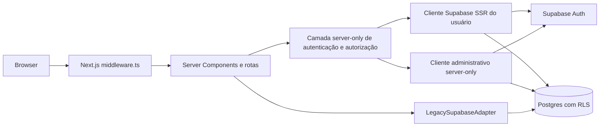
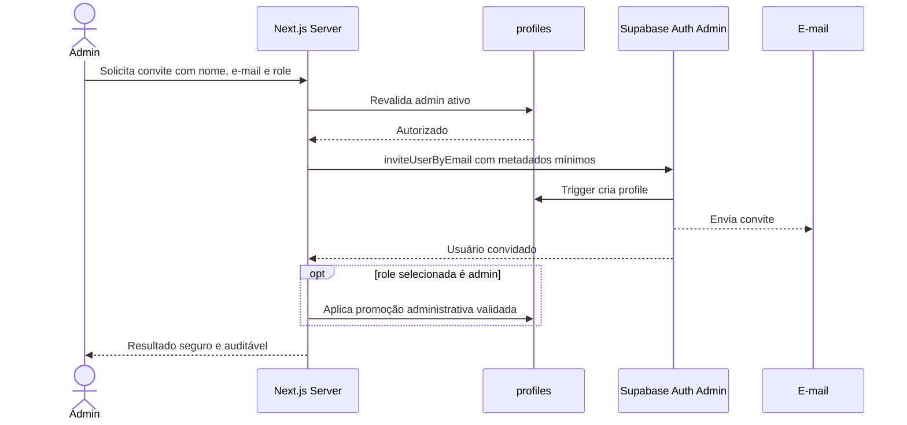
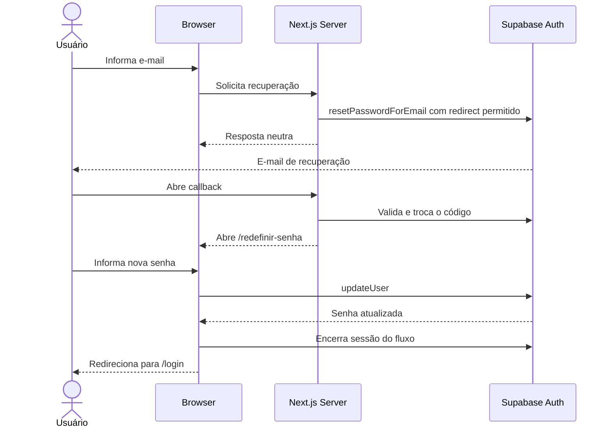

# Arquitetura de autenticação e autorização

## 1. Status

- **Estado:** arquitetura aprovada; implementação ainda não iniciada
- **Data:** 2026-07-19
- **Decisão relacionada:** [ADR-007](decisions/ADR-007-SUPABASE-AUTH-AND-ROLE-BASED-AUTHORIZATION.md)
- **Substitui:** a postergação registrada no [ADR-005](decisions/ADR-005-AUTHENTICATION-AFTER-DOMAIN.md)

Este documento é a fonte autoritativa da arquitetura planejada. Ele não afirma que autenticação, autorização, `profiles`, RLS ou as rotas descritas já existam.

## 2. Contexto

O Compra Car usa Next.js App Router, TypeScript e Supabase. O catálogo legado é lido exclusivamente pelo adaptador server-only existente. A aplicação precisa passar de uma superfície sem login para acesso integralmente autenticado, com administração por convite e dois papéis.

O repositório usa Next.js `15.5.20`. Nesta versão, a convenção aplicável é `middleware.ts`; a migração para `proxy.ts` deverá acompanhar uma futura atualização para Next.js 16 ou superior.

## 3. Objetivos

- autenticar por e-mail e senha com Supabase Auth;
- manter sessão SSR em cookies por `@supabase/ssr`;
- proteger toda a aplicação, exceto rotas de autenticação;
- autorizar por profile atual, papel e estado ativo;
- oferecer convite fechado e recuperação de senha sem enumerar contas;
- aplicar defesa em profundidade no browser, Next.js Server e banco;
- separar clientes Supabase de browser, servidor por usuário e administrativo;
- orientar as implementações das Sprints 2, 3 e 4.

## 4. Não objetivos

- implementar autenticação nesta sprint;
- criar migration, tabela, policy, usuário ou dependência;
- criar autenticação ou armazenamento de senha próprios;
- oferecer cadastro público, login social ou acesso anônimo;
- implementar multi-tenant, escopo por concessionária, marca, equipe ou usuário;
- definir endpoints e contratos definitivos da administração;
- alterar o adaptador legado ou a configuração atual do Supabase.

## 5. Decisões aprovadas

1. Todo o Compra Car exige login. Somente `/login`, `/aceitar-convite`, `/esqueci-senha`, `/redefinir-senha` e o callback técnico estritamente necessário serão públicos.
2. Não existe cadastro público nem `signUp` aberto. Contas nascem por convite administrativo.
3. Os únicos papéis do MVP são `admin` e `vendedor`.
4. Todos os usuários ativos veem o mesmo catálogo. Papel não segmenta dados de catálogo no MVP.
5. `profiles.is_active = false` bloqueia acesso sem excluir `auth.users` ou o profile.
6. Supabase Auth é o provedor de identidade e proprietário de e-mail, senha e sessão.
7. Autorização final ocorre perto do recurso, no servidor e/ou banco; a UI e o Middleware não bastam.
8. Recuperação de senha termina com encerramento da sessão do fluxo e retorno a `/login`.
9. Destinos de retorno aceitam apenas caminhos relativos internos previamente validados.
10. Falta de profile, role inválida ou profile inativo falha de forma fechada.

## 6. Visão geral da solução



O cliente administrativo e o adaptador legado podem usar credencial privilegiada somente no servidor. Como essa credencial pode ignorar RLS, toda operação que a use deve ser precedida de autorização explícita e restringir entrada, operação e resultado.

## 7. Componentes

### Browser client

Cliente criado com URL pública e publishable key, ou a `anon` key legada enquanto aplicável. Inicia login, logout e recuperação e observa sessão, sem receber credenciais administrativas. A sessão SSR não será gerenciada manualmente em `localStorage`.

### Server client por requisição

Cliente `@supabase/ssr` criado com os cookies da requisição. Identifica o chamador, renova tokens e executa acesso sujeito ao contexto do usuário e a RLS. Não deve ser singleton nem carregar cookies entre requisições.

### Cliente administrativo server-only

Cliente separado, importável apenas por módulos com `server-only`, sem persistência ou refresh de sessão do usuário. Será usado para convite e administração após revalidação de `admin` ativo. Nunca compartilha o cliente SSR, pois uma sessão do usuário pode substituir seu cabeçalho de autorização.

### Camada de autenticação e autorização

Serviço server-only centraliza `requireAuthenticatedUser`, `requireActiveProfile` e `requireRole`. Os nomes são conceituais, não contratos definitivos. Deve retornar DTO mínimo e não o registro bruto de Auth ou profile.

### Middleware

Em Next.js 15, `middleware.ts` renova cookies e faz redirecionamentos otimistas. Não consulta autorização detalhada nem substitui validações no servidor ou RLS. Ao migrar para Next.js 16+, passa a `proxy.ts`.

### Supabase

Supabase Auth mantém identidade e credenciais. Postgres mantém `profiles`, constraints e policies. RLS protege toda tabela exposta pela Data API; grants e RLS devem ser auditados em conjunto.

## 8. Autenticação versus autorização

Autenticação responde “quem é o usuário?” e pertence principalmente ao Supabase Auth. Uma sessão criptograficamente válida prova identidade, mas não concede por si só acesso ao Compra Car.

Autorização responde “o usuário pode realizar esta ação agora?”. Cada decisão sensível combina:

- usuário Auth autenticado;
- profile existente;
- `is_active = true` no estado atual do banco;
- papel permitido;
- RLS/grants ou validação server-side junto ao recurso.

Ocultar controles no frontend é apenas UX. Nunca concede nem revoga autoridade.

## 9. Modelo conceitual de dados

Tabela futura, sem migration nesta sprint:

```text
public.profiles
  id uuid primary key references auth.users(id) on delete cascade
  full_name text not null
  role text not null check (role in ('admin', 'vendedor'))
  is_active boolean not null default true
  invited_by uuid null references auth.users(id)
  created_at timestamptz not null
  updated_at timestamptz not null
```

- `profiles.id` é igual ao `auth.users.id`;
- timestamps são UTC e `updated_at` deve ser mantido de forma confiável;
- e-mail permanece em Supabase Auth e não é duplicado no profile;
- profile não contém senha, hash, token ou segredo;
- `invited_by` registra o administrador quando conhecido e aceita `null` para bootstrap;
- roles adicionais exigem nova decisão arquitetural.

Identidade existente, sessão válida, profile ativo e operação autorizada são estados independentes. A ausência de qualquer condição necessária nega acesso.

## 10. Papéis e matriz de permissões

| Recurso/Ação | Admin | Vendedor |
|---|---:|---:|
| Entrar na aplicação | Sim, se ativo | Sim, se ativo |
| Ler catálogo | Sim | Sim |
| Comparar veículos | Sim | Sim |
| Criar/editar catálogo | Sim, futuramente | Não |
| Listar usuários | Sim | Não |
| Convidar usuários | Sim | Não |
| Ativar/desativar usuários | Sim | Não |
| Alterar papel | Sim | Não |
| Ler próprio perfil | Sim | Sim |
| Alterar próprio nome | Sim | Sim |
| Alterar o próprio papel | Não | Não |
| Reativar a si próprio | Não | Não |

Administração de catálogo continua futura. O catálogo de leitura é compartilhado entre todos os profiles ativos.

## 11. Estratégia de sessão SSR

Será usado `@supabase/ssr`, que configura o fluxo PKCE e armazena access e refresh tokens em cookies acessíveis ao ciclo SSR. Browser e servidor usam clientes diferentes. O adaptador de cookies deve aplicar todos os cookies e cabeçalhos de cache fornecidos pela biblioteca ao renovar a sessão.

Ciclo conceitual:

1. Browser envia cookies ao Next.js.
2. Middleware cria cliente SSR e renova sessão quando necessário.
3. Cookies atualizados são propagados na resposta.
4. Server Component, Route Handler ou Server Action cria seu cliente por requisição.
5. Servidor valida a identidade por `getClaims()` ou busca atual por `getUser()` e carrega o profile atual.
6. A operação valida atividade e papel perto do recurso.
7. RLS/grants aplicam a barreira de banco quando o cliente do usuário acessa a Data API.

`getSession()` pode ser usado quando o token bruto for realmente necessário, mas o objeto de usuário carregado diretamente dos cookies não fundamenta decisão de identidade ou autorização. Middleware e servidor validam o token conforme a orientação vigente do Supabase.

Conteúdo autenticado e respostas que renovam cookies não podem entrar em cache público. Profile, sessão e HTML personalizado nunca usam cache global. O cache de catálogo compartilhado pode permanecer apenas porque o conjunto de dados é idêntico para todos os usuários ativos, mas a rota e cada operação continuam protegidas.

## 12. Proteção de rotas

Rotas públicas permitidas:

- `/login`;
- `/aceitar-convite`;
- `/esqueci-senha`;
- `/redefinir-senha`;
- callback Auth técnico, com caminho definitivo na Sprint 3.

Todo o restante é protegido, inclusive `/` e `/comparar`. Usuário sem sessão vai para `/login`. Um destino original pode ser preservado somente como caminho relativo interno. URLs absolutas, protocol-relative, com host, esquema, barra invertida ou origem diferente são rejeitadas; fallback é `/`.

O Middleware faz a triagem de navegação e renova cookies. Cada carregamento protegido e operação server-side repete as validações seguras. O matcher exclui somente assets internos e arquivos estáticos comprovadamente públicos.

## 13. Defense in depth

```text
UI otimista
→ Middleware: sessão e redirect de conveniência
→ DAL/serviço server-only: usuário + profile atual + atividade + role
→ caso de uso/handler: permissão da operação
→ grants + RLS: permissão efetiva no banco
```

Route Handlers são endpoints públicos do ponto de vista de rede e Server Actions também precisam ser tratadas como entradas não confiáveis. Toda entrada é validada e erros públicos não expõem detalhes internos.

## 14. Fluxo de login


Erros de credencial são genéricos. O destino original é restaurado somente após validação local. Login de profile ausente ou inativo é recusado pela aplicação.

## 15. Fluxo de logout

1. Usuário aciona logout.
2. Servidor encerra a sessão Supabase.
3. Cookies são removidos ou invalidados na resposta.
4. Browser vai para `/login`.
5. Estado client-side é descartado; voltar ou recarregar uma rota protegida exige nova validação.

## 16. Fluxo de convite



O cliente administrativo fica no servidor. Até a Sprint 4, o Dashboard do Supabase ou ferramenta administrativa controlada pode enviar convites. Nunca se usa chave privilegiada no navegador.

Estados obrigatórios: convite expirado, utilizado, usuário existente, profile ausente, inativo, falha de envio, falha transacional, reenvio e limite de taxa. Reenvio deve ser idempotente do ponto de vista da interface administrativa e não criar profiles duplicados.

## 17. Fluxo de aceitação de convite

1. Usuário abre link cujo redirect está na allow-list do Supabase.
2. Callback troca o código pelo estado de sessão e valida o tipo do fluxo.
3. `/aceitar-convite` exige contexto de convite válido.
4. Usuário define sua senha; a aplicação nunca armazena nem cria o hash.
5. Servidor carrega o profile e exige `is_active = true`.
6. Conta ativa segue para a aplicação; profile ausente/inativo falha fechado.
7. Link expirado ou já utilizado mostra recuperação segura sem revelar dados da conta.

## 18. Fluxo de recuperação de senha



A resposta pública será: “Caso exista uma conta para este e-mail, você receberá as instruções.” Link expirado ou token inválido gera estado recuperável. Redirects usam allow-list local e do Supabase. A Sprint 3 deve validar o comportamento efetivo de invalidação das demais sessões; até lá, não se assume invalidação instantânea de access tokens já emitidos.

## 19. Tratamento de usuário inativo

`is_active` é verificado no carregamento seguro de páginas protegidas e novamente em Server Actions, Route Handlers, serviços de dados e operações administrativas. Não se consulta somente no login.

Quando `false`:

- `auth.users` e `profiles` permanecem existentes;
- novas entradas são recusadas pela aplicação;
- sessões existentes deixam de autorizar operações na próxima verificação server-side/banco;
- a interface mostra um estado de acesso desativado;
- logout é executado quando apropriado;
- nenhuma exclusão física é usada como desativação.

Para recursos acessados por RLS, policies devem incorporar atividade atual ou chamar função segura que a verifique. Para caminhos que usam credencial com bypass de RLS, a validação server-side atual é obrigatória.

## 20. Estratégia de criação de profile

### Opção A — trigger em `auth.users` (recomendada)

Cria o profile na mesma transação da identidade. Evita usuário Auth confirmado sem profile e falha fechado se a integridade não puder ser mantida. O risco é bloquear a criação Auth por erro no trigger e aumentar o cuidado operacional.

Controles obrigatórios:

- função `security definer` com owner e grants mínimos;
- `search_path` fixo e seguro, referências qualificadas por schema;
- trigger sempre cria `vendedor`, sem confiar em role de `user_metadata`;
- quando o convite selecionar `admin`, o servidor aplica promoção explícita depois de receber a identidade e revalidar o ator; falha parcial deixa o usuário no menor privilégio;
- `full_name` validado sem confiar em campos arbitrários;
- idempotência e telemetria de falhas;
- teste transacional e procedimento de reconciliação.

### Opção B — operação administrativa coordenada

Envia convite, recebe o usuário e cria o profile pelo servidor. Tem fluxo explícito e observável, mas não é atômico entre Auth, banco e e-mail. Exige idempotência, compensação e tratamento de convite enviado com profile ainda ausente.

### Decisão

Adotar a opção A na Sprint 2. A consistência transacional e a negação por falta de profile pesam mais que a simplicidade do fluxo coordenado. Observabilidade e reconciliação continuam obrigatórias. Se testes reais mostrarem incompatibilidade com o fluxo de convite, a troca para B exige atualizar este documento e o ADR antes da implementação.

### Bootstrap do primeiro admin

Procedimento temporário e auditável:

1. criar ou convidar uma identidade pelo Dashboard do Supabase;
2. aplicar o profile `admin` por migration versionada ou script server-side controlado da Sprint 2;
3. confirmar `is_active = true` e integridade do vínculo;
4. testar login e autorização;
5. registrar a execução fora do repositório sem dados pessoais;
6. remover o mecanismo temporário.

Nenhum e-mail, credencial ou usuário real integra a documentação versionada.

## 21. Estratégia de RLS

Sprint 2 deve inventariar grants, schemas expostos e policies existentes antes de criar qualquer policy. Não se presume que `products`, `specs` ou `product_specs` estejam protegidas corretamente.

Para `profiles`:

- usuário autenticado pode ler somente o próprio profile;
- pode atualizar somente `full_name`, com allow-list de colunas;
- não pode alterar `role`, `is_active` ou `invited_by`;
- não pode listar outros profiles;
- administração ocorre por Server Action/Route Handler com revalidação de admin ativo e cliente administrativo isolado.

Para o catálogo, admin e vendedor ativos têm leitura compartilhada; vendedor não tem escrita. Grants limitam quais operações alcançam cada objeto e RLS limita linhas. Tabelas expostas pela Data API exigem ambas as camadas.

Secret/service-role ignora RLS. Seu uso é exceção server-only e requer autorização antes da query, DTO de saída e teste de negação. O nome atual `SUPABASE_SERVER_KEY` não prova seu privilégio e deve ser classificado na Sprint 2 sem alterar o valor ou expô-lo.

## 22. Gestão de chaves

Permitido no cliente:

- URL pública do projeto;
- publishable key atual ou `anon` key legada apropriada.

Exclusivo do servidor:

- secret key;
- `service_role` legada;
- credencial administrativa ou conexão de banco.

Nenhum segredo recebe prefixo `NEXT_PUBLIC_`, entra em Client Component, log, erro, DTO ou resposta. O cliente administrativo deve residir em módulo `server-only`. A Sprint 2 definirá nomes finais das novas variáveis sem reutilizar ambiguamente a credencial atual do adaptador. Valores reais nunca entram no repositório.

## 23. Tratamento de erros

- login usa mensagem genérica para credencial, profile ausente ou estado não revelável;
- recuperação sempre responde de forma neutra;
- convite diferencia conflitos apenas para admin autorizado e sem vazar segredo;
- links expirados ou inválidos oferecem recomeço seguro;
- erros públicos não incluem stack, resposta bruta do Supabase, token ou e-mail de terceiro;
- profile ausente, role inválida e inatividade negam acesso por padrão;
- falha parcial de administração gera evento correlacionável para reconciliação.

## 24. Observabilidade e auditoria

Registrar eventos estruturados sem tokens ou credenciais:

- login bem-sucedido/falho com identificador de correlação, sem senha;
- logout;
- convite solicitado, enviado, reenviado ou falho;
- alteração de role ou atividade, com ator, alvo, antes/depois e data;
- negação por inatividade, falta de profile ou role;
- falha do trigger e reconciliação;
- uso de operação administrativa privilegiada.

Política de retenção, destino dos logs e correlação com auditoria do Supabase permanecem pendentes. E-mail deve ser minimizado ou mascarado conforme necessidade operacional e privacidade.

## 25. Ameaças e mitigações

| Ameaça | Decisão ou ação prevista |
|---|---|
| Chave privilegiada no browser | Cliente administrativo `server-only`; nenhum segredo `NEXT_PUBLIC_` |
| Autorização apenas no frontend | Revalidação server-side e RLS perto do recurso |
| Confiança apenas no Middleware | Middleware é triagem otimista; DAL/handler/banco revalidam |
| Usuário inativo com sessão válida | Consultar profile atual em toda operação sensível e nas policies aplicáveis |
| Alteração indevida de `role` | Coluna fora do update comum; constraint; operação admin auditada |
| Mass assignment de profile | DTO e allow-list somente de `full_name` |
| Enumeração de e-mails | Resposta neutra de recuperação e erros genéricos |
| Open redirect | Aceitar somente caminho relativo interno e allow-list do Supabase |
| Link expirado/inválido | Validar tipo e código; estado recuperável e reenvio controlado |
| CSRF administrativo | SameSite/HTTPS, verificação de origem e proteção adicional conforme transporte escolhido |
| Auth sem profile | Trigger transacional, negação por padrão e reconciliação |
| Profile órfão | FK para `auth.users` com `on delete cascade` |
| Trigger `security definer` inseguro | Owner/grants mínimos, schemas qualificados e testes |
| `search_path` inseguro | `search_path` fixo e sem schemas controláveis por usuário |
| Tokens em logs | Redação e proibição explícita em logs/erros |
| Cache de conteúdo autenticado | `private/no-store` para sessão/profile; nunca cache global por usuário |
| Vendedor executa escrita | Role revalidada no servidor, grants/RLS e testes negativos |
| Bypass acidental de RLS | Cliente admin separado, operações estreitas e auditoria |

Rate limiting para login, recuperação, convite e reenvio deve combinar controles do Supabase e da infraestrutura da aplicação.

## 26. Plano das Sprints 2, 3 e 4

### Sprint 2 — fundação de dados e segurança

- auditar Auth, redirects, grants, RLS, schemas expostos e privilégio de `SUPABASE_SERVER_KEY`;
- versionar migration de `profiles`, constraints, FK, trigger seguro e policies;
- definir clientes browser, SSR e admin e variáveis de ambiente;
- criar bootstrap controlado do primeiro admin;
- testar trigger, RLS, inatividade e negação por role;
- documentar rollback e reconciliação.

### Sprint 3 — autenticação e proteção da aplicação

- instalar `@supabase/ssr` e implementar clientes;
- criar `middleware.ts`, callback e rotas de login/logout;
- implementar aceitação de convite e recuperação de senha;
- criar camada server-only de sessão/profile/autorização;
- proteger páginas, Server Actions, Route Handlers e carregamento de dados;
- testar open redirect, cache, links inválidos e usuário inativo.

### Sprint 4 — administração de usuários

- implementar UI e operações server-side para listar, convidar e reenviar;
- ativar/desativar e alterar role com auditoria;
- adicionar idempotência, rate limiting e tratamento de falhas parciais;
- validar a matriz de permissões ponta a ponta;
- remover o mecanismo temporário de bootstrap.

## 27. Critérios de aceite

- toda rota não Auth é protegida;
- não existe cadastro público;
- roles são somente `admin` e `vendedor`;
- profile ausente/inativo falha fechado;
- cookies SSR usam a integração oficial;
- Middleware não é a barreira final;
- operações sensíveis revalidam sessão, profile, atividade e role;
- RLS/grants cobrem toda superfície exposta;
- cliente administrativo nunca chega ao browser;
- convite e recuperação tratam redirects e erros com segurança;
- testes negativos cobrem vendedor, inativo, profile ausente e bypass privilegiado;
- documentação permanece sincronizada com o estado implementado.

## 28. Questões futuras

- **PENDENTE:** nomes finais das novas variáveis públicas e administrativas após classificar `SUPABASE_SERVER_KEY`;
- **PENDENTE:** caminho definitivo do callback Auth;
- **PENDENTE:** política de senha, MFA e proteção contra credenciais comprometidas;
- **PENDENTE:** limites de taxa por fluxo e infraestrutura;
- **PENDENTE:** SMTP de produção, remetente, templates e expiração de links de convite/recuperação;
- **PENDENTE:** retenção e destino da auditoria;
- **PENDENTE:** comportamento verificado de sessões anteriores após redefinição de senha;
- **PENDENTE:** procedimento operacional de reconciliação Auth/profile;
- **PENDENTE:** migração de `middleware.ts` para `proxy.ts` ao adotar Next.js 16+;
- **PENDENTE:** requisitos futuros de multi-tenant, que não integram o MVP.

## 29. Referências oficiais

### Supabase

- [Server-side rendering](https://supabase.com/docs/guides/auth/server-side)
- [Creating a Supabase client for SSR](https://supabase.com/docs/guides/auth/server-side/creating-a-client?framework=nextjs)
- [Advanced SSR guide](https://supabase.com/docs/guides/auth/server-side/advanced-guide)
- [Choosing a server package](https://supabase.com/docs/guides/auth/choosing-a-server-package)
- [User management and invitations](https://supabase.com/docs/guides/auth/users)
- [`inviteUserByEmail`](https://supabase.com/docs/reference/javascript/auth-admin-inviteuserbyemail)
- [Password-based authentication and recovery](https://supabase.com/docs/guides/auth/passwords)
- [Row Level Security](https://supabase.com/docs/guides/database/postgres/row-level-security)
- [Securing the Data API](https://supabase.com/docs/guides/api/securing-your-api)
- [API key security](https://supabase.com/docs/guides/getting-started/api-keys)

### Next.js

- [Authentication guide](https://nextjs.org/docs/app/guides/authentication)
- [Backend for Frontend and security](https://nextjs.org/docs/app/guides/backend-for-frontend)
- [Next.js 15 Middleware](https://nextjs.org/docs/15/pages/api-reference/file-conventions/middleware)
- [Middleware renamed to Proxy](https://nextjs.org/docs/messages/middleware-to-proxy)
