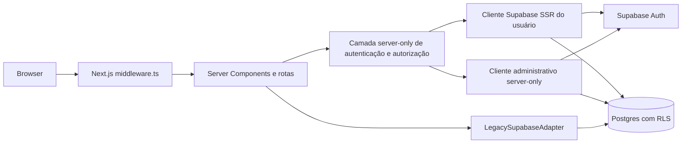
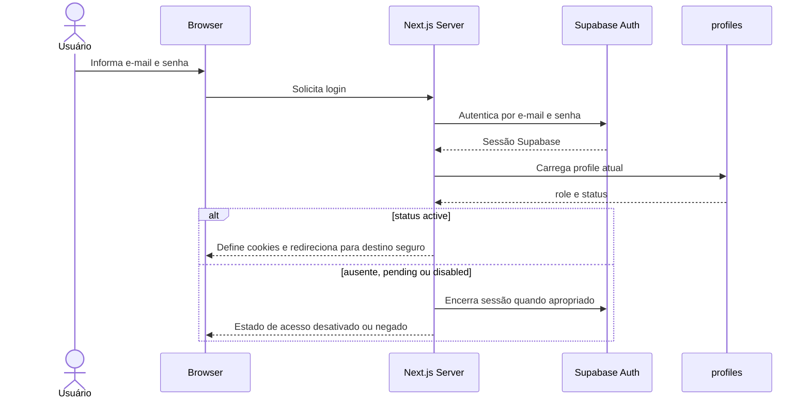
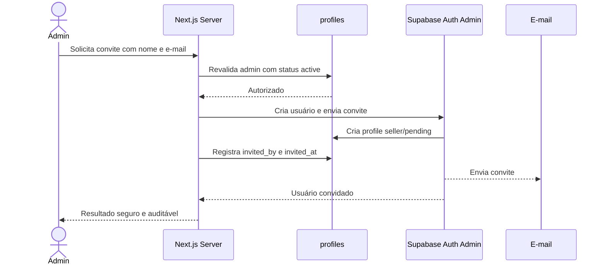
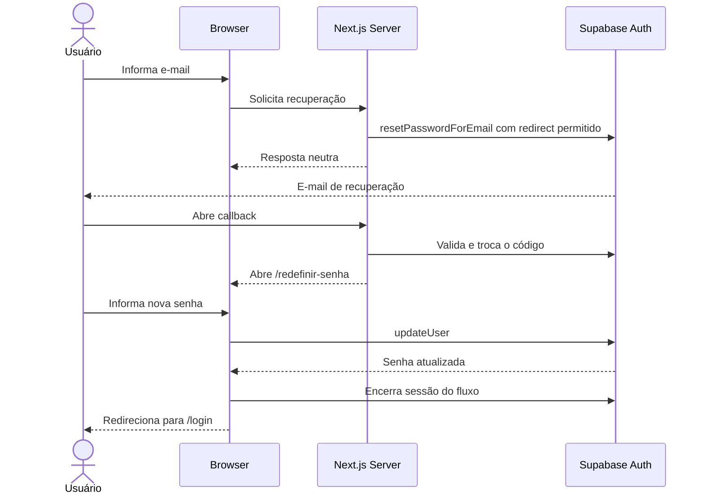

# Arquitetura de autenticação e autorização

## 1. Status

- **Estado:** autenticação SSR e autorização implementadas; migration de profiles aplicada e validada
- **Data:** 2026-07-19
- **Atualização:** 2026-07-23
- **Decisão relacionada:** [ADR-008](decisions/ADR-008-SUPABASE-AUTH-AND-ROLE-BASED-AUTHORIZATION.md)
- **Aplicação única e transição do Appsmith:** [ADR-010](decisions/ADR-010-SINGLE-NEXTJS-APPLICATION-AND-APPSMITH-RETIREMENT.md)
- **Substitui:** a postergação registrada no [ADR-005](decisions/ADR-005-AUTHENTICATION-AFTER-DOMAIN.md)

Este documento é a fonte autoritativa da arquitetura. A migration de `profiles`, enums, triggers, grants e policies está versionada em `supabase/migrations/20260721222256_create_auth_profiles.sql`, usa `seller` e foi aplicada uma única vez no projeto remoto Compra Car App. A validação confirmou enums, tabela, functions, triggers, RLS, policies e grants. O teste `supabase/tests/001_auth_profiles.test.sql` passou após habilitar pgTAP, com rollback das fixtures. Login, logout, clients SSR, Middleware, proteção server-side, área seller, shell administrativo e listagem read-only estão implementados; convite, recuperação de senha, gestão de usuários e CRUD continuam planejados.

## 2. Contexto

O Compra Car usa Next.js App Router, TypeScript e um Supabase compartilhado. O catálogo legado é lido exclusivamente pelo adaptador server-only existente. A aplicação precisa passar de uma superfície sem login para acesso integralmente autenticado, com duas áreas lógicas na mesma aplicação Next.js: `seller` para comparação e `admin` para administração, sendo que `admin` também acessa a área `seller`. O Appsmith não integra mais a arquitetura-alvo e seus artefatos permanecem apenas como referência histórica.

O repositório usa Next.js `15.5.20`. Nesta versão, a convenção aplicável é `middleware.ts`; a migração para `proxy.ts` deverá acompanhar uma futura atualização para Next.js 16 ou superior.

## 3. Objetivos

- autenticar por e-mail e senha com Supabase Auth;
- manter sessão SSR em cookies por `@supabase/ssr`;
- proteger toda a aplicação, exceto rotas de autenticação;
- autorizar por profile atual, papel e status explícito;
- oferecer convite fechado e recuperação de senha sem enumerar contas;
- aplicar defesa em profundidade no browser, Next.js Server e banco;
- separar clientes Supabase de browser, servidor por usuário e administrativo;
- orientar as implementações das Sprints 2, 3 e 4.

## 4. Não objetivos

- ampliar os fluxos Auth já implementados nesta atualização documental;
- executar novas migrations ou alterar o banco;
- criar usuário real;
- criar autenticação ou armazenamento de senha próprios;
- oferecer cadastro público, login social ou acesso anônimo;
- implementar multi-tenant, escopo por concessionária, marca, equipe ou usuário;
- definir endpoints e contratos definitivos da administração;
- alterar o adaptador legado ou a configuração atual do Supabase.

## 5. Decisões aprovadas

1. Todo o Compra Car exige login. Nesta fundação, somente `/login` é público. `/aceitar-convite`, `/esqueci-senha`, `/redefinir-senha` e o callback técnico permanecem routes futuras e só serão públicos quando implementados com suas validações.
2. Não existe cadastro público nem `signUp` aberto. Contas nascem por convite administrativo.
3. As únicas roles do MVP são `admin` e `seller`.
4. Todos os usuários com status `active` veem o mesmo catálogo. Papel não segmenta dados de catálogo no MVP.
5. O status do profile segue o ciclo `pending` → `active` → `disabled`, com reativação de `disabled` para `active`.
6. Supabase Auth é o provedor de identidade e proprietário de e-mail, senha e sessão.
7. Autorização final ocorre perto do recurso, no servidor e/ou banco; a UI e o Middleware não bastam.
8. Recuperação de senha termina com encerramento da sessão do fluxo e retorno a `/login`.
9. Destinos de retorno aceitam apenas caminhos relativos internos previamente validados.
10. Falta de profile, role inválida ou status diferente de `active` falha de forma fechada.
11. Todo profile novo nasce obrigatoriamente com `role = seller` e `status = pending`; nenhuma entrada de usuário ou metadado pode promover automaticamente a `admin`.
12. `profiles` é a fonte de autorização. `user_metadata` pode transportar dados auxiliares, mas não é fonte confiável para privilégios.
13. As áreas `seller` e `admin` residem na mesma aplicação Next.js; `admin` também acessa a área `seller`.
14. Appsmith é referência histórica e não receberá novas implementações.

## 6. Visão geral da solução



O cliente administrativo e o adaptador legado podem usar credencial privilegiada somente no servidor. Como essa credencial pode ignorar RLS, toda operação que a use deve ser precedida de validação explícita de identidade, profile, status, role e escopo, além de restringir entrada, operação e resultado.

## 7. Componentes

### Browser client

Cliente criado com URL pública e publishable key, ou a `anon` key legada enquanto aplicável. Inicia login, logout e recuperação e observa sessão, sem receber credenciais administrativas. A sessão SSR não será gerenciada manualmente em `localStorage`.

### Server client por requisição

Cliente `@supabase/ssr` criado com os cookies da requisição. Identifica o chamador, renova tokens e executa acesso sujeito ao contexto do usuário e a RLS. Não deve ser singleton nem carregar cookies entre requisições.

### Cliente administrativo server-only

Cliente separado, importável apenas por módulos com `server-only`, sem persistência ou refresh de sessão do usuário. Será usado para convite e administração após revalidação explícita de `admin` com status `active`. Nunca compartilha o cliente SSR, pois uma sessão do usuário pode substituir seu cabeçalho de autorização. Toda operação com Service Role valida ator, status, role, entrada e escopo antes de executar; RLS não é a única barreira de operações administrativas.

### Camada de autenticação e autorização

Serviço server-only centraliza `requireAuthenticatedUser`, `requireActiveProfile` e `requireRole`. Os nomes são conceituais, não contratos definitivos. Deve retornar DTO mínimo e não o registro bruto de Auth ou profile.

### Middleware

Em Next.js 15, `middleware.ts` apenas lê ou atualiza a sessão, renova cookies e faz redirecionamentos otimistas. Não consulta o banco, não decide autorização detalhada nem substitui validações no servidor ou RLS. Ao migrar para Next.js 16+, passa a `proxy.ts`.

### Supabase

Supabase Auth mantém identidade e credenciais. Postgres mantém `profiles`, constraints e policies. RLS protege toda tabela exposta pela Data API; grants e RLS devem ser auditados em conjunto.

## 8. Autenticação versus autorização

Autenticação responde “quem é o usuário?” e pertence principalmente ao Supabase Auth. Uma sessão criptograficamente válida prova identidade, mas não concede por si só acesso ao Compra Car.

Autorização responde “o usuário pode realizar esta ação agora?”. Cada decisão sensível combina:

- usuário Auth autenticado;
- profile existente;
- `status = active` no estado atual de `profiles`;
- papel permitido;
- RLS/grants ou validação server-side junto ao recurso.

Ocultar controles no frontend é apenas UX. Nunca concede nem revoga autoridade.

## 9. Modelo conceitual de dados

Modelo físico versionado na Sprint 2.1:

```text
public.app_role enum ('admin', 'seller')
public.user_status enum ('pending', 'active', 'disabled')

public.profiles
  id uuid primary key references auth.users(id) on delete cascade
  full_name text null
  role public.app_role not null default 'seller'
  status public.user_status not null default 'pending'
  invited_by uuid null references public.profiles(id) on delete set null
  disabled_by uuid null references public.profiles(id) on delete set null
  invited_at timestamptz null
  accepted_at timestamptz null
  disabled_at timestamptz null
  created_at timestamptz not null default now()
  updated_at timestamptz not null default now()
```

- `profiles.id` é igual ao `auth.users.id`;
- timestamps são UTC e `updated_at` deve ser mantido de forma confiável;
- e-mail permanece em Supabase Auth e não é duplicado no profile;
- profile não contém senha, hash, token ou segredo;
- `full_name` aceita `null` quando os metadados de apresentação `full_name` e `name` não contêm texto válido;
- `invited_by` registra o profile do administrador quando conhecido e aceita `null` para bootstrap;
- todo novo profile recebe obrigatoriamente `role = seller` e `status = pending`;
- `accepted_at` é preenchido quando o convite é aceito e a senha é definida;
- `disabled_by` e `disabled_at` são preenchidos na desativação e limpos na reativação;
- a exclusão do profile de um ator limpa `disabled_by` e `disabled_at` juntos antes do `ON DELETE SET NULL`, preservando a constraint do par;
- `last_login_at` não integra o modelo nesta fase;
- roles adicionais exigem nova decisão arquitetural.

`profiles` é a fonte confiável para role e status. Claims ou `user_metadata` não concedem privilégios. Identidade existente, sessão válida, profile com status `active` e operação autorizada são estados independentes. A ausência de qualquer condição necessária nega acesso.

### Ciclo de status

| Evento | Status resultante | Metadados de ciclo de vida |
|---|---|---|
| Convite enviado | `pending` | registra `invited_by` e `invited_at` |
| Convite aceito e senha definida | `active` | registra `accepted_at` |
| Desativação administrativa | `disabled` | registra `disabled_by` e `disabled_at` |
| Reativação administrativa | `active` | limpa `disabled_by` e `disabled_at` |

Não há transição automática para `admin`. A mudança de papel é uma operação administrativa distinta, explícita e auditável.

## 10. Papéis e matriz de permissões

| Recurso/Ação | `admin` | `seller` |
|---|---:|---:|
| Entrar na aplicação | Sim, se `active` | Sim, se `active` |
| Ler catálogo | Sim | Sim |
| Comparar veículos | Sim | Sim |
| Criar/editar catálogo | Sim, futuramente | Não |
| Listar usuários | Sim | Não |
| Convidar usuários | Sim | Não |
| Desativar/reativar usuários | Sim | Não |
| Alterar papel | Sim | Não |
| Ler próprio perfil | Sim | Sim |
| Alterar próprio nome | Sim | Sim |
| Alterar o próprio papel | Não | Não |
| Reativar a si próprio | Não | Não |

A listagem administrativa somente leitura de `products` está implementada e exige `admin` ativo antes da consulta server-side. Criação, edição, duplicação, exclusão, equipamentos e preços continuam futuros. O catálogo seller permanece compartilhado entre todos os profiles com status `active`.

## 11. Estratégia de sessão SSR

Será usado `@supabase/ssr`, que configura o fluxo PKCE e armazena access e refresh tokens em cookies acessíveis ao ciclo SSR. Browser e servidor usam clientes diferentes. O adaptador de cookies deve aplicar todos os cookies e cabeçalhos de cache fornecidos pela biblioteca ao renovar a sessão.

Ciclo conceitual:

1. Browser envia cookies ao Next.js.
2. Middleware cria cliente SSR e renova sessão quando necessário.
3. Cookies atualizados são propagados na resposta.
4. Server Component, Route Handler ou Server Action cria seu cliente por requisição.
5. Servidor valida a identidade por `getClaims()` ou busca atual por `getUser()` e carrega o profile atual.
6. A operação valida `status = active` e papel perto do recurso.
7. RLS/grants aplicam a barreira de banco quando o cliente do usuário acessa a Data API.

`getSession()` pode ser usado quando o token bruto for realmente necessário, mas o objeto de usuário carregado diretamente dos cookies não fundamenta decisão de identidade ou autorização. Middleware e servidor validam o token conforme a orientação vigente do Supabase.

Conteúdo autenticado e respostas que renovam cookies não podem entrar em cache público. Profile, sessão e HTML personalizado nunca usam cache global. O cache de catálogo compartilhado pode permanecer apenas porque o conjunto de dados é idêntico para todos os usuários com status `active`, mas a rota e cada operação continuam protegidas.

## 12. Proteção de rotas

Route pública implementada:

- `/login`;

Routes públicas planejadas, ainda não implementadas nem liberadas pelo Middleware:

- `/aceitar-convite`;
- `/esqueci-senha`;
- `/redefinir-senha`;
- callback Auth técnico, com caminho definitivo na Sprint 3.

Todo o restante é protegido, inclusive `/` e `/comparar`. Usuário sem sessão vai para `/login`. Um destino original pode ser preservado somente como caminho relativo interno. URLs absolutas, protocol-relative, com host, esquema, barra invertida ou origem diferente são rejeitadas; fallback é `/`.

O Middleware faz a triagem de navegação e renova cookies. Cada carregamento protegido e operação server-side repete as validações seguras. O matcher exclui somente assets internos e arquivos estáticos comprovadamente públicos.

## 13. Defense in depth

```text
UI otimista
→ Middleware: leitura/atualização de sessão e redirect de conveniência, sem consulta ao banco
→ DAL/serviço server-only: usuário + profile atual + status + role
→ caso de uso/handler: permissão da operação
→ grants + RLS: permissão efetiva no banco
```

Route Handlers são endpoints públicos do ponto de vista de rede e Server Actions também precisam ser tratadas como entradas não confiáveis. Toda entrada é validada e erros públicos não expõem detalhes internos.

## 14. Fluxo de login



Erros de credencial são genéricos. O destino original é restaurado somente após validação local. Login de profile ausente ou com status diferente de `active` é recusado pela aplicação.

## 15. Fluxo de logout

1. Usuário aciona logout.
2. Servidor encerra a sessão Supabase.
3. Cookies são removidos ou invalidados na resposta.
4. Browser vai para `/login`.
5. Estado client-side é descartado; voltar ou recarregar uma rota protegida exige nova validação.

## 16. Fluxo de convite



O cliente administrativo fica no servidor. Todo convite cria uma identidade no Supabase Auth e um profile com `role = seller`, `status = pending`, `invited_by` e `invited_at`. Nenhum parâmetro do convite, `user_metadata`, trigger ou valor padrão pode criar um `admin`. Até a Sprint 4, o Dashboard do Supabase ou ferramenta administrativa controlada pode enviar convites, desde que o profile e os metadados obrigatórios sejam mantidos pelo procedimento aprovado. Nunca se usa chave privilegiada no navegador.

Estados obrigatórios: convite expirado, utilizado, usuário existente, profile ausente, `pending`, `active`, `disabled`, falha de envio, falha transacional, reenvio e limite de taxa. Reenvio deve ser idempotente do ponto de vista da interface administrativa e não criar profiles duplicados.

## 17. Fluxo de aceitação de convite

1. Usuário abre link cujo redirect está na allow-list do Supabase.
2. Callback troca o código pelo estado de sessão e valida o tipo do fluxo.
3. `/aceitar-convite` exige contexto de convite válido.
4. Usuário define sua senha; a aplicação nunca armazena nem cria o hash.
5. Servidor carrega o profile e exige `status = pending` para concluir o aceite.
6. Após a senha ser definida, o servidor altera o status para `active` e registra `accepted_at`.
7. Conta com status `active` segue para a aplicação; profile ausente ou em estado incompatível falha fechado.
8. Link expirado ou já utilizado mostra recuperação segura sem revelar dados da conta.

## 18. Fluxo de recuperação de senha



A resposta pública será: “Caso exista uma conta para este e-mail, você receberá as instruções.” Link expirado ou token inválido gera estado recuperável. Redirects usam allow-list local e do Supabase. A Sprint 3 deve validar o comportamento efetivo de invalidação das demais sessões; até lá, não se assume invalidação instantânea de access tokens já emitidos.

## 19. Desativação e reativação

O status atual é verificado no carregamento seguro de páginas protegidas e novamente em Server Actions, Route Handlers, serviços de dados e operações administrativas. Não se consulta somente no login.

Na desativação, uma operação administrativa explícita altera o status para `disabled` e registra `disabled_by` e `disabled_at`. Nesse estado:

- `auth.users` e `profiles` permanecem existentes;
- novas entradas são recusadas pela aplicação;
- sessões existentes deixam de autorizar operações na próxima verificação server-side ou no banco;
- o servidor nega acesso e RLS também deve negar o acesso aplicável;
- a interface mostra um estado de acesso desativado;
- logout é executado quando apropriado;
- nenhuma exclusão física é usada como desativação.

Na reativação, uma operação administrativa explícita altera o status para `active` e limpa `disabled_by` e `disabled_at`. Ela não muda o papel do usuário nem substitui as validações normais de autorização.

Para recursos acessados por RLS, policies devem incorporar `status = active` ou chamar função segura que o verifique. Para caminhos que usam credencial com bypass de RLS, a validação server-side atual é obrigatória antes da execução. RLS complementa, mas não substitui, a validação administrativa no servidor.

## 20. Estratégia de criação de profile

### Opção A — trigger em `auth.users` (recomendada)

Cria o profile na mesma transação da identidade. Evita usuário Auth confirmado sem profile e falha fechado se a integridade não puder ser mantida. O risco é bloquear a criação Auth por erro no trigger e aumentar o cuidado operacional.

Controles obrigatórios:

- função `security definer` com owner e grants mínimos;
- `search_path` fixo e seguro, referências qualificadas por schema;
- trigger sempre cria `seller`/`pending`, sem confiar em role ou status de `user_metadata`;
- promoção para `admin` nunca faz parte do convite ou do aceite e exige operação manual ou administrativa separada, explícita e auditável;
- `full_name` validado sem confiar em campos arbitrários;
- unicidade obrigatória, tratamento explícito de colisões e telemetria de falhas; não usar `ON CONFLICT DO NOTHING` nem ocultar profile duplicado, pois a operação deve falhar de forma fechada e seguir o procedimento de reconciliação;
- teste transacional e procedimento de reconciliação.

### Opção B — operação administrativa coordenada

Envia convite, recebe o usuário e cria o profile pelo servidor. Tem fluxo explícito e observável, mas não é atômico entre Auth, banco e e-mail. Exige idempotência, compensação e tratamento de convite enviado com profile ainda ausente.

### Decisão

Adotada a opção A. A migration cria `role = seller` e `status = pending`; seus testes SQL refletem os mesmos valores e passaram no ambiente autorizado. O nome opcional continua limitado a `raw_user_meta_data.full_name` ou, como fallback, `raw_user_meta_data.name`; metadados de autorização nunca são lidos. Observabilidade e reconciliação continuam obrigatórias.

### Bootstrap do primeiro admin

Procedimento temporário e auditável:

1. convidar uma identidade pelo Dashboard do Supabase, com `invited_by = null` apenas para este bootstrap;
2. confirmar que o profile foi criado como `seller`/`pending` e concluir o aceite para torná-lo `active`;
3. promover o profile para `admin` por uma operação manual, explícita, controlada e registrada fora do fluxo automático;
4. testar login e autorização;
5. registrar a execução fora do repositório sem dados pessoais;
6. remover o mecanismo temporário.

Nenhum e-mail, credencial ou usuário real integra a documentação versionada. A implementação futura deverá definir o runbook e o mecanismo exatos; esta decisão documental não cria migration, SQL ou script.

## 21. Estratégia de RLS

Sprint 2 deve inventariar grants, schemas expostos e policies existentes antes de criar qualquer policy. Não se presume que `products`, `specs` ou `product_specs` estejam protegidas corretamente.

Para `profiles`:

- usuário autenticado pode ler somente o próprio profile;
- pode atualizar somente `full_name`, com allow-list de colunas;
- não pode alterar `role`, `status`, `invited_by`, `disabled_by` ou timestamps de ciclo de vida;
- não pode listar outros profiles;
- administração ocorre por Server Action/Route Handler com revalidação de `admin`/`active` e cliente administrativo isolado.

Para o catálogo, `admin` e `seller` com status `active` têm leitura compartilhada; `seller` não tem escrita administrativa. Grants limitam quais operações alcançam cada objeto e RLS limita linhas. Tabelas expostas pela Data API exigem ambas as camadas.

Secret/service-role ignora RLS. Seu uso é exceção server-only e requer validação explícita de identidade, profile atual, `status = active`, role, entrada e escopo antes da execução, além de DTO de saída e teste de negação. RLS nunca é a única barreira para operações administrativas. O nome atual `SUPABASE_SERVER_KEY` não prova seu privilégio e deve ser classificado na Sprint 2 sem alterar o valor ou expô-lo.

## 22. Gestão de chaves

Permitido no cliente:

- URL pública do projeto;
- publishable key atual ou `anon` key legada apropriada.

Exclusivo do servidor:

- secret key;
- `service_role` legada;
- credencial administrativa ou conexão de banco.

Nenhum segredo recebe prefixo `NEXT_PUBLIC_`, entra em Client Component, log, erro, DTO ou resposta. O cliente administrativo deve residir em módulo `server-only`. A Sprint 2 definirá nomes finais das novas variáveis sem reutilizar ambiguamente a credencial atual do adaptador. Valores reais nunca entram no repositório.

## 23. Tratamento de erros

- login usa mensagem genérica para credencial, profile ausente ou estado não revelável;
- recuperação sempre responde de forma neutra;
- convite diferencia conflitos apenas para admin autorizado e sem vazar segredo;
- links expirados ou inválidos oferecem recomeço seguro;
- erros públicos não incluem stack, resposta bruta do Supabase, token ou e-mail de terceiro;
- profile ausente, role inválida e status diferente de `active` negam acesso por padrão;
- falha parcial de administração gera evento correlacionável para reconciliação.

## 24. Observabilidade e auditoria

Registrar eventos estruturados sem tokens ou credenciais:

- login bem-sucedido/falho com identificador de correlação, sem senha;
- logout;
- convite solicitado, enviado, reenviado ou falho;
- alteração de role ou status, com ator, alvo, antes/depois e data;
- negação por status `pending`/`disabled`, falta de profile ou role;
- falha do trigger e reconciliação;
- uso de operação administrativa privilegiada.

Política de retenção, destino dos logs e correlação com auditoria do Supabase permanecem pendentes. E-mail deve ser minimizado ou mascarado conforme necessidade operacional e privacidade.

### Tabela futura `audit_log`

Uma tabela de auditoria é evolução futura e não será implementada nesta sprint. Seu modelo conceitual é:

```text
public.audit_log
  id uuid primary key
  actor_user_id uuid null
  action text not null
  entity_type text not null
  entity_id uuid null
  before_data jsonb null
  after_data jsonb null
  ip_address inet null
  user_agent text null
  created_at timestamptz not null
```

Eventos futuros mínimos:

- `user.invited`;
- `user.invite_resent`;
- `user.activated`;
- `user.disabled`;
- `user.reactivated`;
- `user.role_changed`;
- `user.password_reset_requested`;
- `admin.mfa_enabled`.

O desenho físico, retenção, proteção de dados, acesso de leitura e estratégia para registrar eventos sem permitir adulteração permanecem **PENDENTE**.

### MFA futuro

MFA não será implementado nesta sprint. Em fase posterior, será obrigatório para `admin`; para `seller`, não será obrigatório no MVP. A fase futura deverá definir enrollment, recuperação, fatores aceitos e comportamento de bloqueio antes da implementação.

## 25. Ameaças e mitigações

| Ameaça | Decisão ou ação prevista |
|---|---|
| Chave privilegiada no browser | Cliente administrativo `server-only`; nenhum segredo `NEXT_PUBLIC_` |
| Autorização apenas no frontend | Revalidação server-side e RLS perto do recurso |
| Confiança apenas no Middleware | Middleware não consulta o banco; DAL/handler/banco revalidam |
| Usuário `disabled` com sessão válida | Consultar profile atual em toda operação sensível e nas policies aplicáveis |
| Alteração indevida de `role` | Coluna fora do update comum; constraint; operação admin auditada |
| Mass assignment de profile | DTO e allow-list somente de `full_name` |
| Enumeração de e-mails | Resposta neutra de recuperação e erros genéricos |
| Open redirect | Aceitar somente caminho relativo interno e allow-list do Supabase |
| Link expirado/inválido | Validar tipo e código; estado recuperável e reenvio controlado |
| CSRF administrativo | SameSite/HTTPS, verificação de origem e proteção adicional conforme transporte escolhido |
| Auth sem profile | Trigger transacional, negação por padrão e reconciliação |
| Profile órfão | FK para `auth.users` com `on delete cascade` |
| Trigger `security definer` inseguro | Owner/grants mínimos, schemas qualificados e testes |
| `search_path` inseguro | `search_path` fixo e sem schemas controláveis por usuário |
| Tokens em logs | Redação e proibição explícita em logs/erros |
| Cache de conteúdo autenticado | `private/no-store` para sessão/profile; nunca cache global por usuário |
| `seller` executa escrita administrativa | Role revalidada no servidor, grants/RLS e testes negativos |
| Bypass acidental de RLS | Cliente admin separado, operações estreitas e auditoria |

Rate limiting para login, recuperação, convite e reenvio deve combinar controles do Supabase e da infraestrutura da aplicação.

## 26. Estado das Sprints 2, 3 e 4

### Sprint 2 — fundação de dados e segurança — concluída no escopo mínimo

- migration de `profiles`, constraints, FK, trigger, policies e grants versionada e aplicada;
- pgTAP habilitado no schema `extensions` e teste SQL aprovado com rollback;
- clients Auth browser e SSR separados do adapter legado;
- roles/status e negação por profile inválido cobertos por testes;
- gestão automatizada e runbook formal de usuários continuam fora do escopo.

### Sprint 3 — autenticação e proteção da aplicação — concluída na fundação vigente

- `@supabase/ssr`, clients, cookies, `middleware.ts`, login e logout implementados;
- camada server-only de sessão/profile/autorização implementada;
- páginas, Server Actions e carregamento administrativo protegidos;
- open redirect, cookies, logout, roles e estados inválidos cobertos por testes;
- callback, convite e recuperação de senha continuam planejados.

### Sprint 4 — administração de usuários — não implementada

- implementar UI e operações server-side para listar, convidar e reenviar;
- desativar/reativar e alterar role com auditoria;
- adicionar idempotência, rate limiting e tratamento de falhas parciais;
- validar a matriz de permissões ponta a ponta;
- remover o mecanismo temporário de bootstrap.

## 27. Critérios de aceite da fundação implementada

- toda rota não Auth é protegida;
- não existe cadastro público;
- roles são somente `admin` e `seller`;
- profile ausente ou status diferente de `active` falha fechado;
- cookies SSR usam a integração oficial;
- Middleware apenas lê/atualiza sessão e redireciona, sem consultar o banco;
- operações sensíveis revalidam sessão, profile, status e role;
- RLS/grants cobrem toda superfície exposta;
- cliente administrativo nunca chega ao browser;
- testes negativos cobrem `seller`, `pending`, `disabled`, profile ausente e bypass privilegiado;
- documentação permanece sincronizada com o estado implementado.

Convite, recuperação de senha, administração de usuários, MFA e auditoria possuem critérios arquiteturais definidos, mas ainda não são funcionalidades implementadas.

## 28. Questões futuras

- **PENDENTE:** nomes finais das novas variáveis públicas e administrativas após classificar `SUPABASE_SERVER_KEY`;
- **PENDENTE:** caminho definitivo do callback Auth;
- **PENDENTE:** política de senha e proteção contra credenciais comprometidas;
- **PENDENTE:** implementação futura de MFA obrigatório para `admin`, sem obrigatoriedade para `seller` no MVP;
- **CONCLUÍDO:** migration e testes SQL usam `seller`; migration aplicada e teste pgTAP aprovado no projeto remoto auditado;
- **PENDENTE:** limites de taxa por fluxo e infraestrutura;
- **PENDENTE:** SMTP de produção, remetente, templates e expiração de links de convite/recuperação;
- **PENDENTE:** desenho físico, retenção e destino da futura `audit_log`;
- **PENDENTE:** comportamento verificado de sessões anteriores após redefinição de senha;
- **PENDENTE:** procedimento operacional de reconciliação Auth/profile;
- **PENDENTE:** migração de `middleware.ts` para `proxy.ts` ao adotar Next.js 16+;
- **PENDENTE:** requisitos futuros de multi-tenant, que não integram o MVP.

## 29. Referências oficiais

### Supabase

- [Server-side rendering](https://supabase.com/docs/guides/auth/server-side)
- [Creating a Supabase client for SSR](https://supabase.com/docs/guides/auth/server-side/creating-a-client?framework=nextjs)
- [Advanced SSR guide](https://supabase.com/docs/guides/auth/server-side/advanced-guide)
- [Choosing a server package](https://supabase.com/docs/guides/auth/choosing-a-server-package)
- [User management and invitations](https://supabase.com/docs/guides/auth/users)
- [`inviteUserByEmail`](https://supabase.com/docs/reference/javascript/auth-admin-inviteuserbyemail)
- [Password-based authentication and recovery](https://supabase.com/docs/guides/auth/passwords)
- [Row Level Security](https://supabase.com/docs/guides/database/postgres/row-level-security)
- [Securing the Data API](https://supabase.com/docs/guides/api/securing-your-api)
- [API key security](https://supabase.com/docs/guides/getting-started/api-keys)

### Next.js

- [Authentication guide](https://nextjs.org/docs/app/guides/authentication)
- [Backend for Frontend and security](https://nextjs.org/docs/app/guides/backend-for-frontend)
- [Next.js 15 Middleware](https://nextjs.org/docs/15/pages/api-reference/file-conventions/middleware)
- [Middleware renamed to Proxy](https://nextjs.org/docs/messages/middleware-to-proxy)
